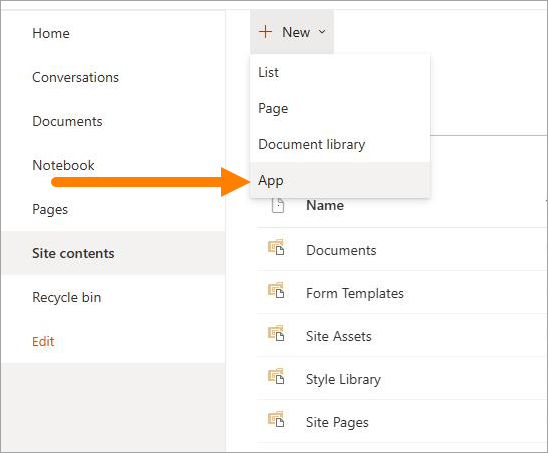

Webparts
===================================

If you're using SharePoint pages in an Omnia implementation, you can use these webparts (called blocks in Omnia) on any SharePoint page. Click LEARN TO USE IT to go to the block description page.

**Note!** There are a few, small differences compaired to the block description in the Omnia documentation. A few options that are not applicable to SharePoint have been removed.

(All available webparts are not shown in the image).

Prepare the SharePoint site
--------------------------------
For every SharePoint site where you would like to use webparts, you have to do the following:

1. Attach the SharePoint site to Omnia.
2. Activate the app feature SPFx infrastructure for the SharePoint site.

How to use a webpart in SharePoint
**************************************
Here's how to use a webpart from Omnia in SharePoint:

1. Download the webpart(s) from Omnia.
2. Go to SharePoint admin https://[YOURTENANTNAME]-admin.sharepoint.com
3. Select "More features".
4. Select "Open" under "Apps".

5. Click "Upload" and select the webpart package downloaded from Omnia admin. 
6. Enable the webpart either on all sites or to be added to individual sites.

Adding a webpart to individual sites
^^^^^^^^^^^^^^^^^^^^^^^^^^^^^^^^^^^^^^
When a webpart is added to individual sites, the site owner can add it this way:

1. Go to "Site contets" of the site. 
2. Select "New" > "App".

3. Click "Add" on the Omnia web part and "Add" to verifiy.

The webpart can now be added to a page like any other webpart.

