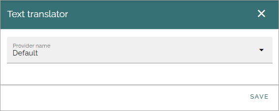
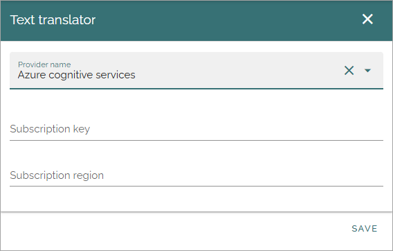

Text translator
=======================================

A default Omnia translator is always available. No settings are needed to use the default translator. 

Azure cognitive services is also always available but to use it you need a payed subscription.

When you have an Azure cognitive services subscription, you have to add some settings here:

If you have installed another text translator, you have to add similar settings.

