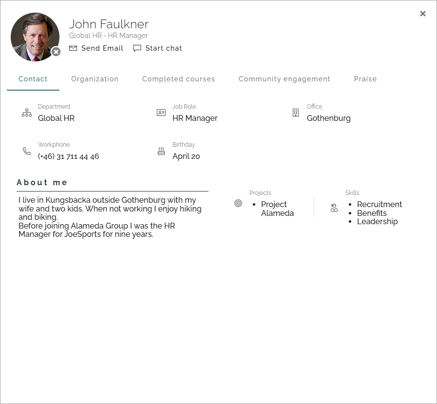
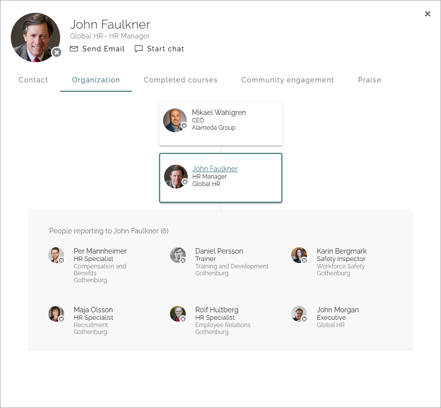
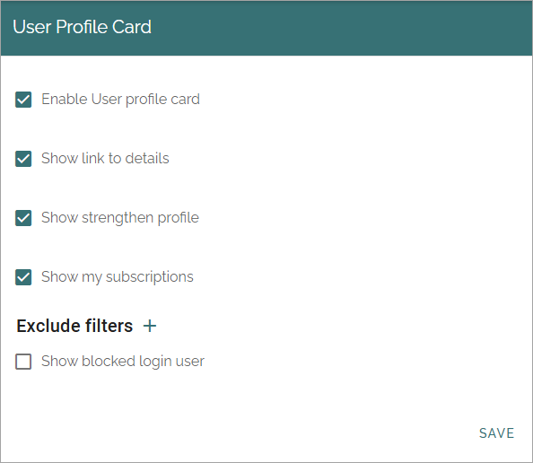
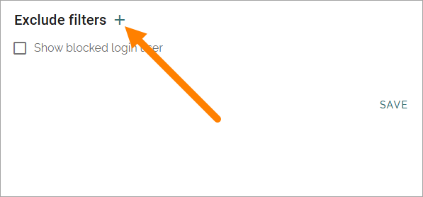
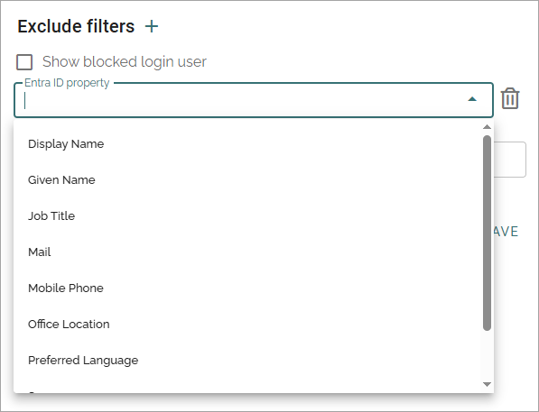
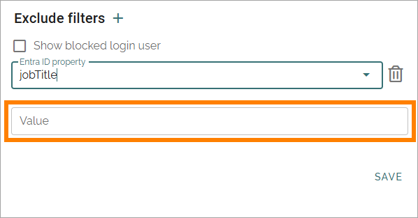

User profile card
===================

The user profile card will be shown (if the option is activated here) whenever you click on a user name in Omnia. The user profile card is designed to align with user profile cards in other services in Microsoft 365.

Here's an exmple from Omnia 7.8:

The user profile card also includes the possibility to browse who reports to whom in the organization. Here's an example from Omnia 7.8:

Settings
***********
The following settings are available:

+ **Enable User profile card**: If the profile card should be used within the tenant, select this option. If you choose not to, the person's Delve profile is shown instead.
+ **Show link to details**: If it should be possible to go to the person's profile from the user profile card, select this option. In Omnia online the person's Delve page is linked to when this option is selected (see the Go to Delve link in images aboove). In Omnia o-nPrem, the link goes to the person's My Profile page.
+ **Show strengthen profile**: If the Strengthen Profile button should be shown on the card, select this option. The button is used to access the Strengthen Profile dialog.
+ **Show my subscriptions**: If the My Subscription button should be shown on the card, select this option. The button is used to access the My Subscriptions dialog.
+ **Exclude filters**: If some users registered in your system should NOT be displayed in the organization tree in the Organization Tree block, add filters for them using Entra ID properties and value. An example is if your organization is in education, probably just the staff should have access to the intranet, not the students.
+ **Show blocked login user**: Select this option to list logged in users that are excluded by the filter(s) you have added above. 

For more information about Strengthen Profile, see this page: :doc:`Strengthen Profile </user-options/strengthen-profile/index>`

For more information about My Subscriptions, see this page: :doc:`My Subscriptions </user-options/my-subscriptions/index>`

The user card layout can be handled in User types, see this page for more information: :doc:`User types </admin-settings/tenant-settings/user-management/user-types/index>`

It can be possible for auser to edit some of the information directly on the card. See this page for more information: :doc:`Edit your user profile card </user-options/edit-user-profile-card/index>`

Adding exclude filters
*************************
To add exclude filters, do the following:

1. Click the plus to add a filter.

2. Select Entra ID property.

Note that if you can't find the property you are looking for in the last, it can still be available. Type the name of the property in the field to search for it.

3. Add a value for the property.

4. Click SAVE.
5. Continue the same way until all exclude filters has been added.

