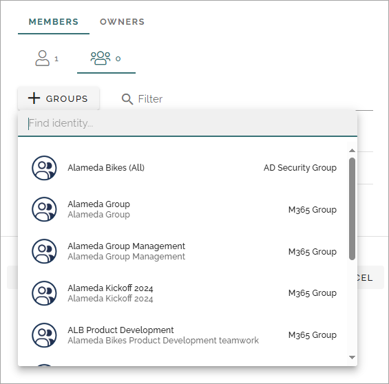

Groups (User management) in Omnia 7.8
======================================

**This page is being edited.**

This page describes the functionality in Omnia 7.8. For Omnia 7.7 and earlier, see: :doc:`User management groups </admin-settings/tenant-settings/user-management-gropups/index>`

Here, all groups in the tenant are listed and you can create and delete your own Omnia groups for security setups.

If you're working with User management for a business profile, groups can be created and edited the same way there, and is then valid for that business group only.

All groups
*************
A list of all groups can look like this:

When you edit an Omnia group, all settings are available, as when you add a new group, see below. Regarding groups and users from MS Graph, only added properties, if any, can be edited, not the information that originates from MS Graph.

Note that you can search and filter on "Group type". If you would like a list of the Omnia groups only, select "Omnia group" as group type.

Add a new group
----------------
Click the ADD GROUP button to create a new Omnia group, and use these settings:

Here you can add an image for the group using the Image picker, add a name and description and add Omnia users (members) to the group. The users must be added to the Users list first, see this page for more information: :doc:`Users (Omnia 7.8) </admin-settings/tenant-settings/user-management/users-78/index>`

You can also add users to the Owners group, if more than the tenant administrator should be able to edit the group. Users are added the same way to this group as to the Members group.

Add users to a group
---------------------------------
Omnia users and Entra ID users can be added to an Omnia group.

Do the following:

1. Click the USERS button and add one or more users from the list.

The added users are now shown. If you selected a user by mistake, use the dust bin to remove the user from the group.

.. image:: add-users-2-78-new.png

The filter can be used to find one or more users in a long list.

Add groups to an Omnia group
------------------------------
You can add Omnia groups and Entra ID groups to an Omnia group (you can't add Omnia groups to an Entra group, though).

1. Click the Groups icon.

2. Click the GROUPS button and add one or more groups from the list.

The added groups are now shown. You an use the pen to edit the groups's settings, if it's an Omnia group, or check the group's settings if it's an Entra ID group. Use the dust bin to remove the group from the group.

The filter can be used to find one or more groups in a long list.

Editing Omnia groups
----------------------
To edit a group, click the > icon at the far right.

Edit the settings as needed:

You add users as described above. To remove a user from the group, click the dust bin. You can also delete the group from here.

See information for a Microsoft Graph group
-----------------------------------------------
You can't change anything for a Microsoft Graph group, but you can see a list of members in the group. Here's an example:

Deleted groups
***************
In the list of deleted groups you can restore deleted Omnia groups or delete (Purge) them permanently. Select one or more groups and then select what to do with them. Here's an example fropm a test environment:

You can't restore deleted Microsoft Graph groups but you can purge them from your system.

