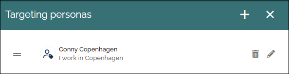
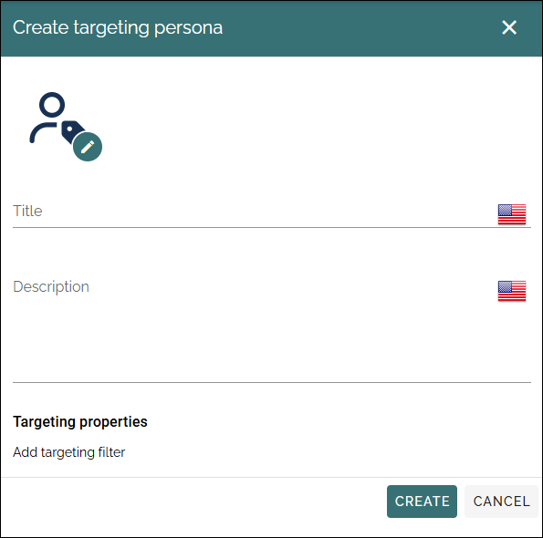
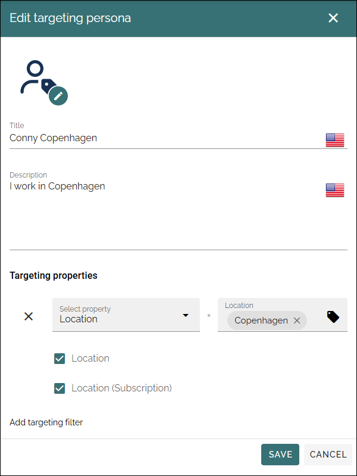

Targeting personas
================================

To test targeting settings you can use targeting personas, so you don't have to use real users for that purpose. Set them up here. Available in Omnia 7.12 and later.

All settings can be edited using the pen.

Create a new targeting persona
*******************************
Us these settings for a new persona:

Add a title (name) and description for the persona. You can add one or more targeting filters.

Here's an example from the danish targeting persona in the list above:

