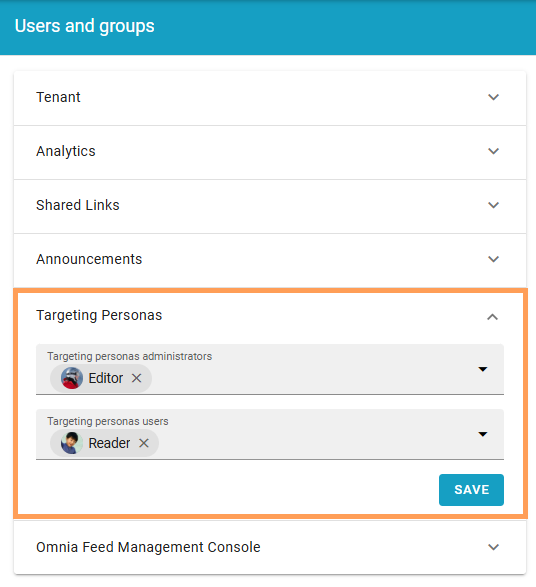

Using targeting personas
================================

In Omnia 7.12 and later, targeting personas can be created for testing purposes.

For creating targeting personas, see: :doc:`Targeting personas </admin-settings/tenant-settings/user-management/targeting-personas/index>`

Permissions for targeting personas
*************************************
The collagues that should be able to admin and use targeting personas must be added to the tenant permissions:

Targeting personas administrators can create and edit personas, and use them. Targeting personas users can just use them. Tenant administrators are targeting personas admninistrators per default, they don't need to be added here.

Using a targeting persona
***************************
Colleagues allowed to use targeting personas can find a list of the created personas in My profile. Here's how to use them:

1. Open My profile.
2. Select targeting persona.

.. image:: select-targeting-person.png
