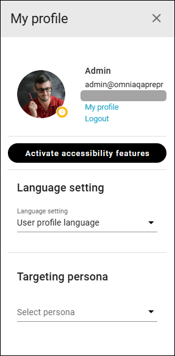

Using targeting personas
================================

In Omnia 7.12 and later, targeting personas can be used for testing purposes.

**Important note**: Only targeting is applied — **not permissions**. As long as you are browsing the intranet as a targeting persona, a red frame is displayed all around the screen to make you aware of tha fact.

For creating targeting personas, see: :doc:`Targeting personas </admin-settings/tenant-settings/user-management/targeting-personas/index>`

Permissions for targeting personas
*************************************
The collagues that should be able to admin and use targeting personas must be added to the tenant permissions.

See the heading "Targeting personas" on this page: :doc:`Permissions for the tenant </admin-settings/tenant-settings/permissions/index>`

Using a targeting persona
***************************
Colleagues allowed to use targeting personas can find a list of the created personas in My profile. Here's how to use them:

1. Open My profile.
2. Select targeting persona.

