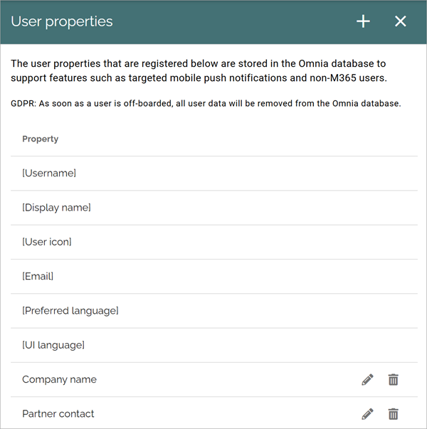
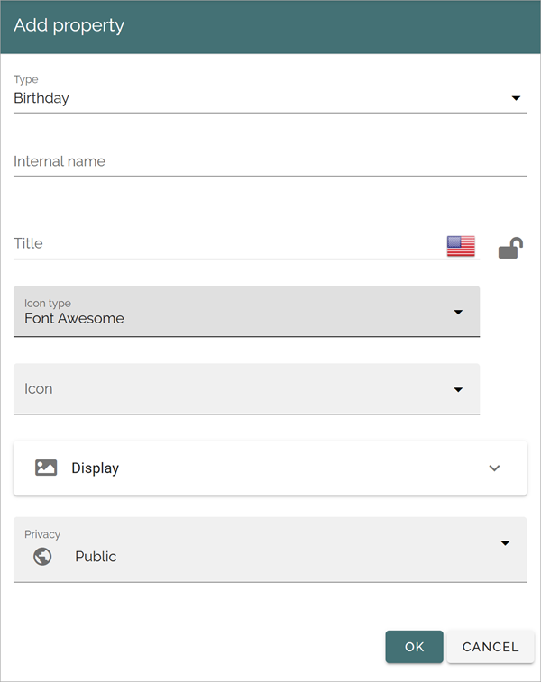
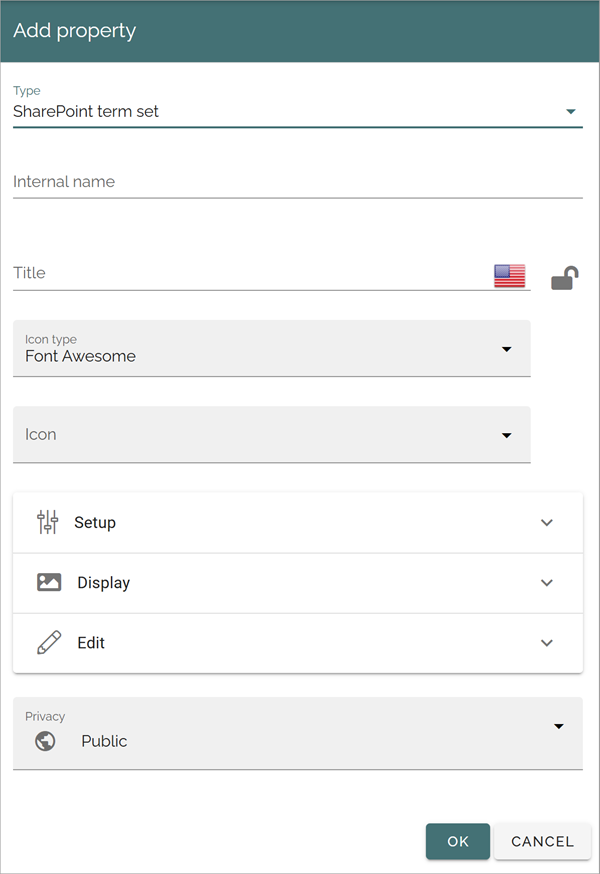
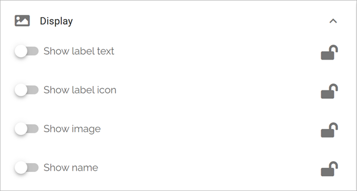

User properties
=============================================

The properties you want to use when creating Omnia users must be present in this list. These properties can also be shown on the customized user profile cards together with properties from Entra ID and SharePoint. Besides that, they will also be used to manage targeted mobile push notifications and statistics. Also note the comment about GDPR.

A number of default properties are always available. They can not be edited or deleted. If you need additional properties you add them here as described below.

Here's an example of user properties. The ones with a pen and a dust bin are added by an administrator.

When adding a new property, the following settings are available:

The list of options at the bottom can differ depending on type of property. For more information, see below.

You can "lock" the settings for a property and then it can't be edited anywhere else but here. If a property is unlocked the settings can be edited in the Property block. Click the icon to lock or unlock.

Setup and Edit can be also be available, as here for a SharePoint term set.

The privacy setting can be Private or Public. A private property can only be read by the actual user.

Setup
-------
Available for type "SharePoint term set" only. For a property of that type to work, it must be mapped using the list available under Setup.

Display
---------
§For most properties you can choose to display label text and label icon, and for some properties additional options are available. Here's an examnple for type "Identity":

Edit
------
These types have edit options: 

+ HTML - you can choose to display the edit options; Rich text, Limited rich tect or Custom rich text.
+ Identity - you can choose to allow "Multi-value" for the property.
+ Image - you can set default scaling, decide which crop ratios that should be available and decide to force default scaling.
+ Phone number - you can choose to allow "Multi-value" for the property.
+ SharePoint term Set - you can choose to allow "Multi-value" for the property.

Deleting a user property
**************************
When you delete a user property from this list, it's moved to the property recycle bin, available under the tenant settings Properties, see: :doc:`Property recycle bin </admin-settings/tenant-settings/properties/recycle-bin/index>`

