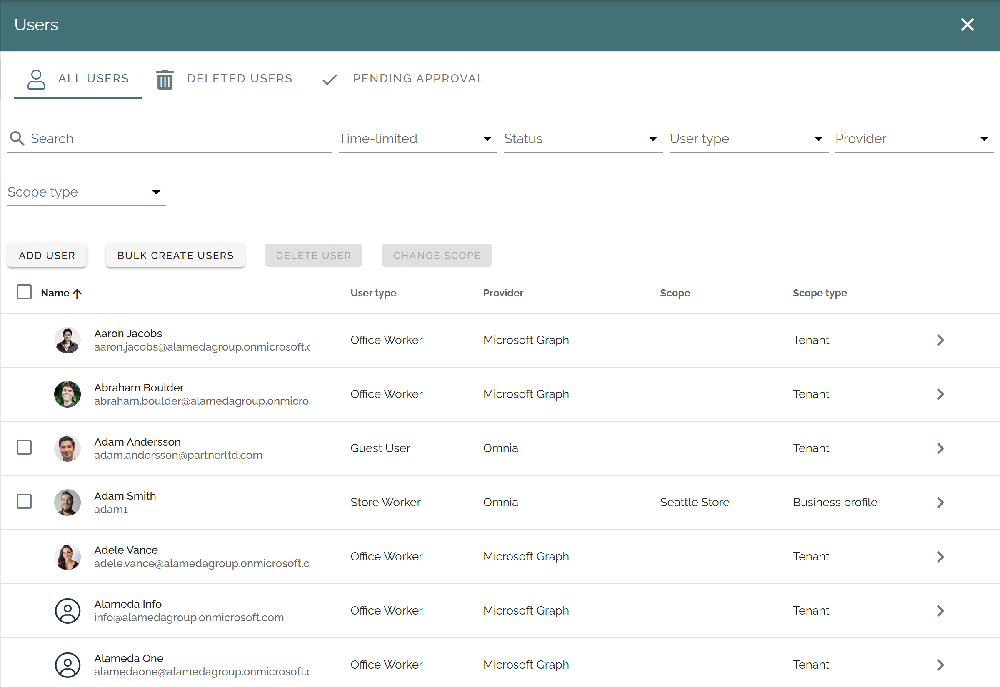
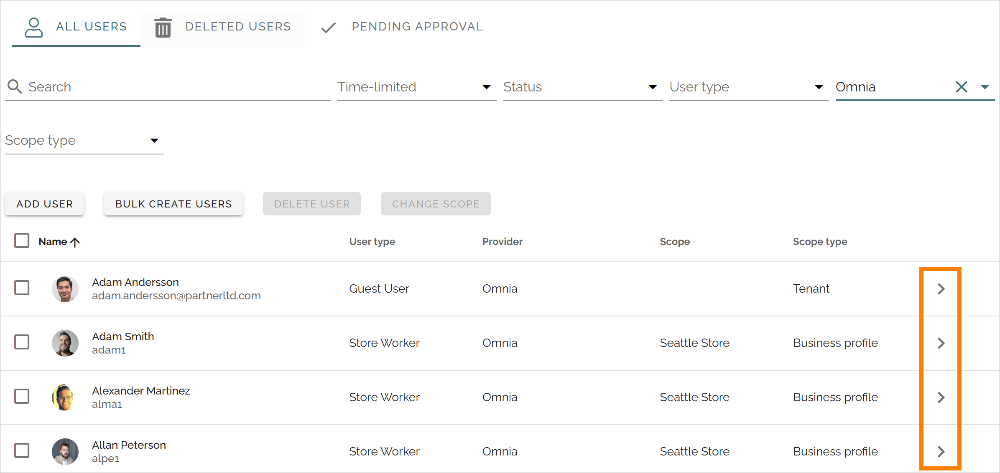
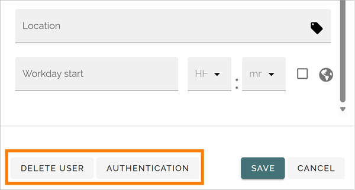
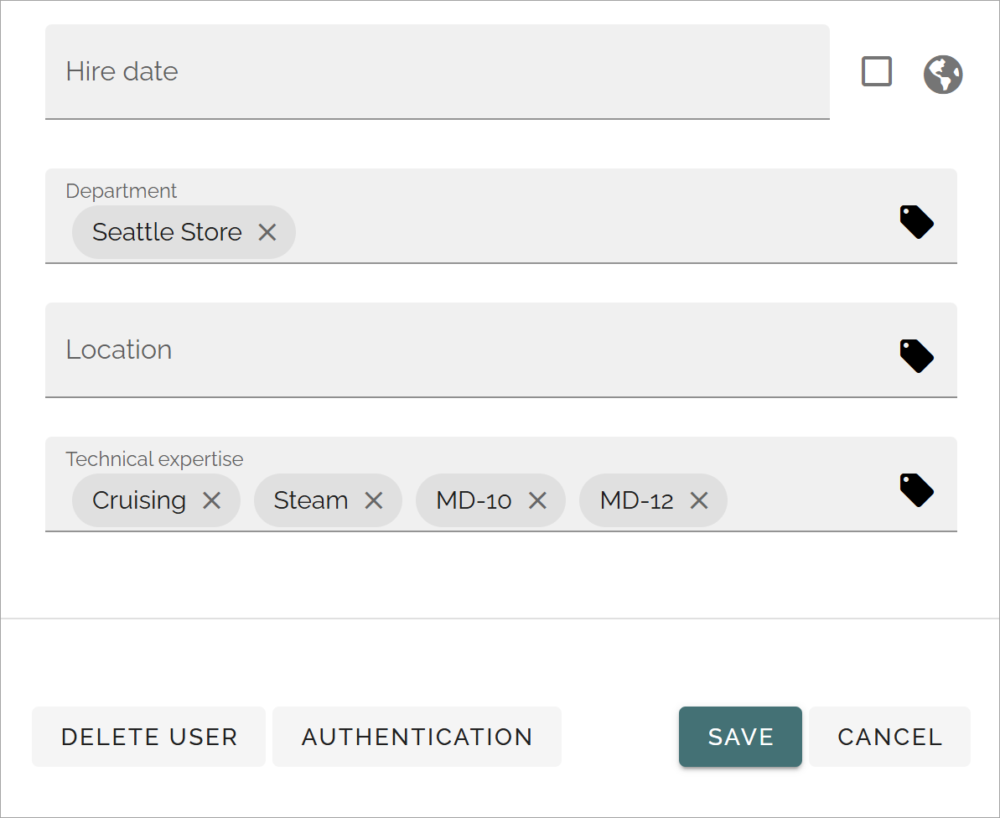

Users (User management) in Omnia 7.8
======================================

This page describes the Users list in tenant user management, in Omnia 7.8. For 7.7 and earlier, see: :doc:`User management users in Omnia 7.7 </admin-settings/tenant-settings/user-management/users-78/index>`

User management is available in each business profile, see: :doc:`Users management options for business profiles </admin-settings/business-group-settings/user-management-bp/index>`

Three lists are available here; ALL USERS, DELETED USERS and PENDING APPROVAL. Note that users set up under User management in a business profile is listed here as well.

All users
************
In the ALL USERS list, all users in the tenant are listed. Here you can add Omnia users - users that do not require a Microsoft 365 license, and delete users you have added this way.

Note that you can use the search field to find a user and use the filters for a shorter list (see more info about this below). 

**Tip**: If you would like to list Omnia users created here, select "Omnia" for "Provider".

For more information on editing users, see below.

**A note for users of earlier Omnia versions**: The general settings for authentication has been moved to business profile settings. See this page for more information: :doc:`User management settings - business profile </admin-settings/business-group-settings/user-management-bp/index>`

Filters for the All users list
---------------------------------
The following filters are available, to display only some users in the list:

+ **Time-limited**: For user accounts with a limited time, you can choose to list active or not active accounts.
+ **Status**: Here you can choose to list enabled or disabled accounts.
+ **User type**: Using this filter you can choose to list just one of the §registrered user types.
+ **Provider**: You can choose to list just one of the providers, usually Microsoft Graph or Omnia.
+ **Scope type**: Here you can choose which users to display in the list; Tenant, Business profile or Group. If you select Business profil or Group, you then select which one as the second step.

Add a new Omnia user
-----------------------------
To add a new user, click the ADD USER button.

Available fields are the properties set up under the option in the User management menu. Here's an example:

.. image:: user-management-users-settings-1-75.png

The following options are always available:

+ **User type**: Select user type in the list. User types that should be available here must be set up using the option in the User management menu.
+ **Authentication information**: Add an authentication Email. This is mandatory. If needed, enter a  phone number for mobile authentication.
+ **Time-limited account**: if this user account should be active for a specific time period only, select this option and set the start and ned date.
+ **Email the on-boarding link to the user**: You can chosse to send an on-boarding Email to the user by selecting this option. The Email is sent when the user is saved.

Note that you can enable, disable or reset an Omnia user account using the authentication settings (the key), see above.

Bulk create users
-------------------
By clicking BULK CREATE USERS you can onboard a number of users. Here's the settings you can use:

.. image:: user-management-users-settings-1-75-new.png

The first step is to select user type and the scenario:

+ **User type**: You can bulk create users for one user type in each session. Note the option "Undefined". If users imported from MS Graph does not match any of the rules, user type is set to "Undefined". You should probably not bulk create such users, but the option is there if you know what you're doing.
+ **Select bulk create users scenario**: Choose to send onboarding links to all users of that user type, or not. You can alos automatically onboard users that already has a password assigned to them.

The second step is to edit the template file. If you already have a template file you can edit the file for use in this session and upload it.

If you don't have a template file, download the default template and edit it with the application you normally use for csv files. 

There should be one row for each user to create (onboard) in the csv file. Also, you must not touch the top row, you should not edit anything there.

**Note!** If you use Excel to edit the csv file, you must select "Text to columns" before you start editing. 

About limitations for Omnia users
-----------------------------------
As mentioned, Omnia users do not require a Microsoft 365 licence, and that means no options that are depending on SharePoint or Microsoft 365 can be used. That includes, for example; Teams functionality, Teamworks, Document management, Process management and search.  

When creating pages, or rather page templates, that will be used by Omnia users, it's important to consider which blocks to use. No block that depends on SharePoint works for these users, at least not as intended, including rollups.

All other aspects regarding pages works well for Omnia users, but keep in mind that permissions must be handled through Omnia groups or Dynamic groups for these users.

Editing Omnia users or Microsoft Graph users
----------------------------------------------
To edit a user, click the > icon at the far right.

The following settings are available for Omnia users:

and these:

If you need to reinitiate the whole onboarding process for the user, click RESET ACCOUNT. You can also enable or disable an Omnia user accounts from here.
Save the changes when you're finished.

Delete an Omnia user
-------------------------
To delete one or more Omnia users, do the following:

1. Select the user/users.
2. Click the DELETE USER button that has become available, or click the dust bin for a single user.

.. image:: user-management-users-delete-75.png

The Deleted users list
***********************
You can use this list to restore deleted Omnia users or delete users permanently (Purge). To restore or pemanently delete a single user, use the buttons at the right of the user's row.

.. image:: user-management-users-delete-buttons-75.png

To restore or permanently delete a number of users, select them first and use the buttons at the top:

.. image:: user-management-users-delete-buttons-top-75.png

The Pending approval list
***************************
If self service for user accounts are allowed, and if approval is needed for these accounts, approval is handled through this list.

.. image:: user-management-users-pending.png

Click the pen for available actions:

.. image:: user-management-users-pending-actions.png

and these:

.. image:: user-management-users-pending-actions-more.png

This information is created during the account set up process. Available fields and options depend on various authentication settings. The images above is just examples.

Everything here can be edited if needed.

When you're ready, click APPROVE or REJECT. If you choose to approve, the account is created and the user is notified. If you reject the request, type a message to explain why this request can't be approved. That message is sent to the user.

Self-service is set up (if used) on business profile level. See this page for more information: :doc:`Self-service settings </admin-settings/business-group-settings/user-management-bp/self-service-users-bp/index>`

