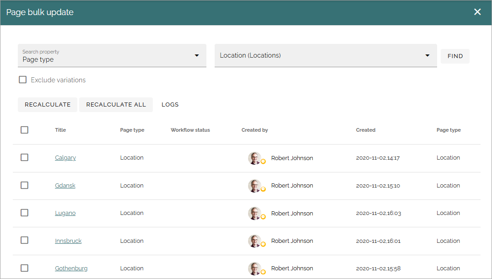

Page bulk update
===================================

**This is a new option in Omnia 7.9. This description is ongoing.**

Use this option to bulk update any of the defined page properties. Note that the properties can be updated for all pages, including variations.

Also note that the user executing the bulk update must have access to the pages that should be updated. Pages that the user does not have access to are simply not shown in the list.

New versions of the pages being bulk updated are automatically created.

.. image:: pages-bulk-update-1-v79.png

1. Select "Search property".
2. In "Property value", add the value to be replaced.
3. Click FIND.

A list of pages that has the selected property defined is displayed.

4. In "New value", add the value that should replace the one you selected.
5. Select all pages that should replace the value.
6. Click REPLACE.

or

5-6. Just click REPLACE ALL to replace all present in the list.

.. image:: pages-bulk-update-2-v79.png

Be aware that, if there are many pages selected, the update may take some time.

When the update is finished, the update is noted in the page history of each page.

A log post is created for every bulk update. Click LOGS to find out what was updated and if it was successful.

Bulk update removed (people) properties
*******************************************
It's possible to replace former colleagues that are not longer present in the system. A good example when this is useful is when a colleague has left the organization and already has been removed from the AD. This is how it's done:

1. Select the property to be replaced (for example Process owner).
2. Click "Search deleted users". Now only deleted users will be shown in the "Search value" list.
3. Enter the property to be replaced in the second Property value field (a former colleague).
4. Click FIND to list the pages.
5. Enter a new value (a colleauge) in the "New value" field.
6. Select all pages that should replace the value.
7. Click REPLACE.

or

6-7. Just click REPLACE ALL to replace all present in the list.

Bulk update properties for page types
*******************************************
If a new property is added to a page type after the solution has been running for a while, you can bulk update all pages of that type.

Example: A property with a a calculated date like "Review date" or "Archive date" is added, that is part of a governance initiative that was not included in the setup project. After adding the new property to the page type you can use bulk update to find all pages of that page type and then recalculate the property to ensure all pages actually gets a review date.

You can select the pages that should be updated and then select RECALCULATE or just click RECALCULATE ALL to update all pages present in the list.

