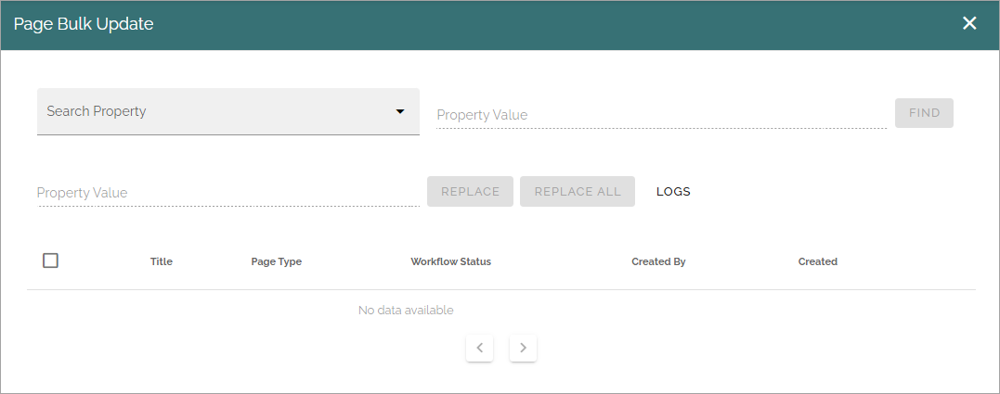
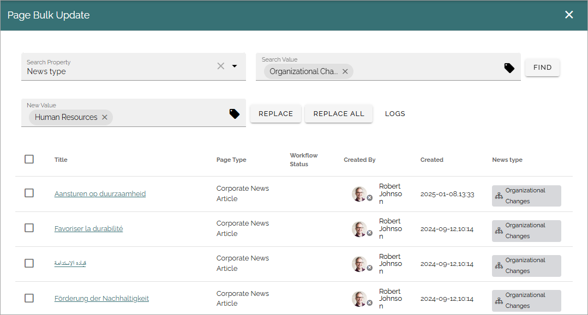

Page bulk update
===================================

**This page is just started.**

This is a new option in Omnia 7.9. This description is preliminary and ongoing (most of the text copied from Document bulk update as a starter).

Use this option to bulk update any of the defined page properties, or page types. Note that not all properties can be updated this way. 

Also note that the user executing the bulk update must have access to the pages that should be updated. Pages that the user does not have access to are simply not shown in the list.

1. Select "Search property".
2. In "Property value", add the value to be replaced.
3. Click FIND.

A list of pages that has the selected property defined is displayed.

4. In "New value", add the value that should replace the one you selected.
5. Select all pages that should replace the value.
6. Click REPLACE.

Be aware that, if there are many pages selected, the update may take some time.

When the update is finished, the update is noted in the page history of each page.

Bulk update removed properties
*********************************
It's possible to replace properties that are not longer present in the system. A good example when this is useful is when a page owner has left the organization and already has been removed from the AD. This is how it's done:

1. Select the property to be replaced (for example Page owner).
2. Enter the property to be replaced in the second Property value field (for example a former colleague). Note that you can use FIND for a listing of for example the pages a former colleague are page owner of.
3. Enter a new value (for example a colleauge) in the "New value" field.
4. Click REPLACE.

Heres's an example:

.. image:: page-bulk-update-owner-v79.png

