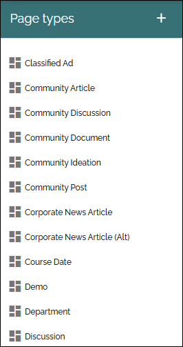
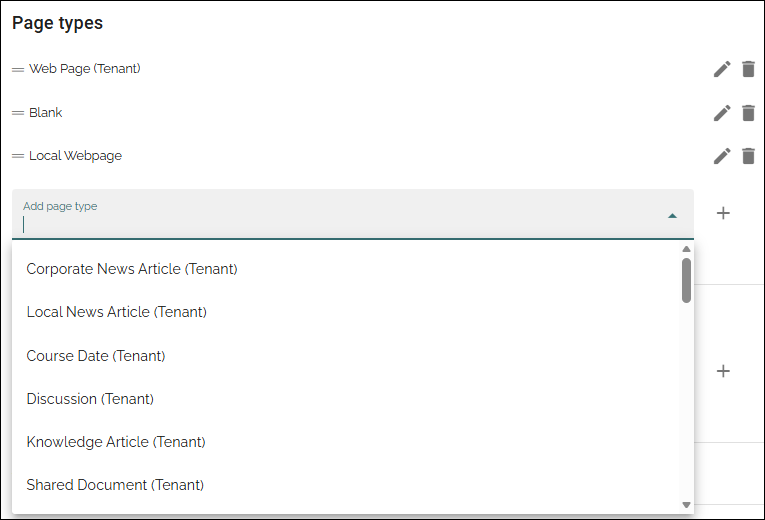
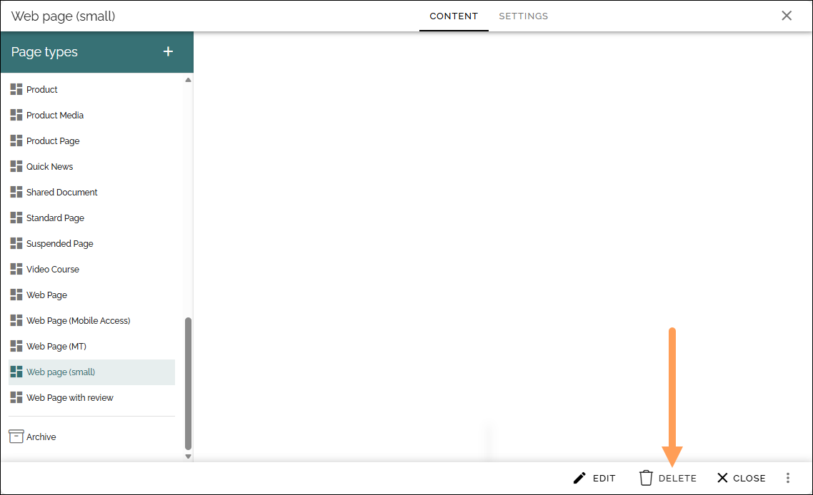
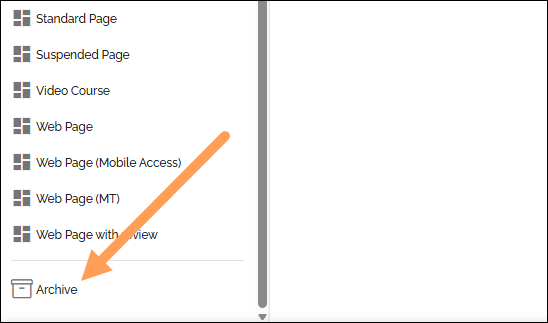

Tenant page types
====================

Tenant page types can be created to be used in any publishing app in the tenant.

The tenant page types are handled from here:

You create and edit the tenant page types exactly the same way as the local page types, as described here: :doc:`Page types </pages/page-types/index>`

If you're looking for a decsription of the page types settings, see this page: :doc:`Page types settings </pages/page-types/page-type-settings/index>`

The "only" difference is that the tenant page types are created and edited here, they are not visible in the list "Page types" in the publishing app, but can be available when an editor creates a new page.

**A tip!** If you go to a suitable page before going to Omnia admin, the preview can show some content when you edit tenant page types.

Adding tenant page types
******************************
You add tenant page types using the list in the publishing app settings:

The page types can then be used by page editors to create pages.

**Important note!** If a tenant page type is edited and published, it is updated for all pages using the page type all over the tenant!

Moving a page type to tenant
*******************************
If you already have a local page type you want to use as a tenant page type, you can easily "make a tenant page type" of it.  

See this page for more information: :doc:`Move a local page type to tenant </pages/page-types/moving-page-type-to-tenant/index>` 

Deleting a tenant page type
******************************
You can delete a tenant page type:

Note that you must save or discard any changes that has not been saved, for the DELETE option to be available. You can delete a draft as well, but it must have been saved at least once.

Deleted Tenant page types are placed in the tenant archive:

This archive works the same way as the archive for the local page types, see: :doc:`Delete or restore a page type </pages/page-types/archive-restore-page-type/index>`
