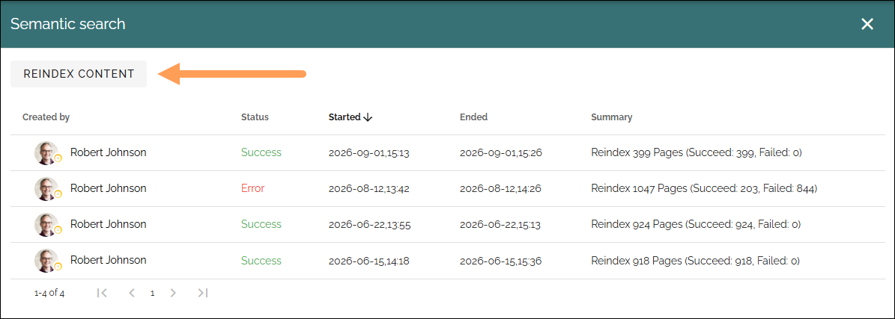

Semantic search - reindex pages
====================================

Use this Web content management option to make sure all Omnia pages in the tenant are indexet for semantic search. This will most likely need to done now and then. Available in Omnia 7.12 and later.

Just click REINDEX CONTENT:

When a reindex is running, a TERMINATE CURRENT JOB button is shown so you can stop the reindex if needed. You can also see info about the progress.

Other than that, you can see info about recent reindexing and if it succeeded or not.

If the reindex failes, just try again. If you experience repeated failures, report an issue to Omnia support.

