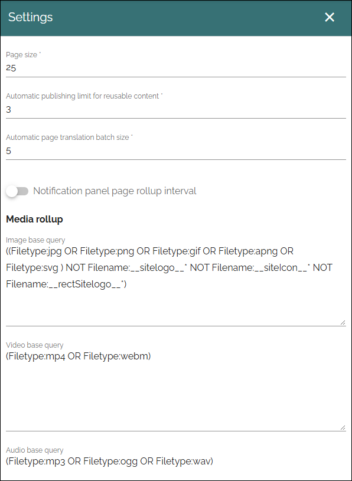

Settings (Web content management)
=====================================

These settings can be used in specialized setups. Normally you don't need to change them. Description of options in Omnia 7.12.

(All options are not shown in the image above, but described below. Also note tha SAVE button at the very end.) 

+ **Page Size**: This is a setting for the number of navigation nodes to be opened per level. if there's more nodes, they can be opened by expanding the list the normal way.
+ **Automatic publishing limit for reusable content**: If there are pages where a lot of reusable content are used on other pages, it's a good idea to limit the publishing that occur automatically, for the system to run smoother. It works this way: The number you set here is published automatically. Then a button is shown, that the author must click on for the rest of the reusable content publishing to take place.
+ **Automatic page translation batch size**: If you use automatic page translations you can set the number of pages translated in each batch here. 
+ **Notification Panel Page Rollup interval**: If you would like to set the page rollup interval in the notification panel, select this option. You could test to change this setting if you have performance issues, but it will only have any effect in very rare cases.
+ **Media rollup**: Here you can add or edit the bas querys used in the Media rollup block.
+ **SharePoint page query**: Here you can add or edit the base querys used in the SharePoint page block.
+ **SharePoint page rollup base query**: Here you can add or edit the base querys used in the SharePoint page rollup block.

