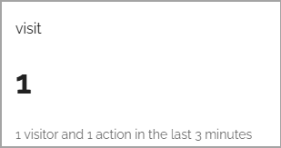
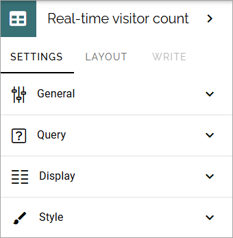
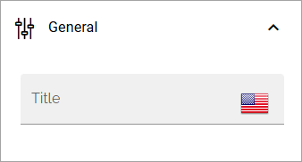
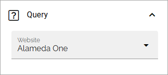
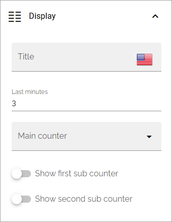
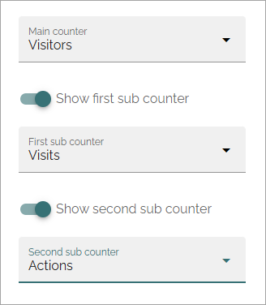
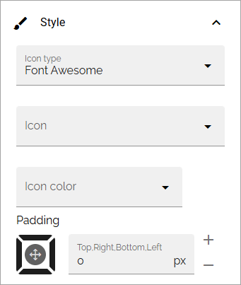

Analytics counter (Real-time visitor count)
==============================================

Use this block to display a simple analytics counters for a chosen website. Here's an example, just after setting up the block up, so not much has happened yet (image from Omnia 7.8).

Settings for the block
*************************

The following settings are available:

General
-----------
As usual for a block, a block title can be added here, in any tenant language.

Query
-----------
Here you select the site to display analytics data for:

Display
------------
The following settings are available for Display:

+ **Title**: You can add a title that will be placed above the counters.
+ **Last minutes**: Enter the number of minutes to display analytics for. This will also be shown in the block, see the example above.
+ **Main counter**: Select the main counter: Visits, Visitors or Actions.
+ **Show first/second sub cunter**: You can show the other counters as subcounters. See below for an example.

Here's an example where all three counters will be displayed, Visitors as main counter, Visits as the first sub counter and Actions as the second:

Style
----------
Here you can set some padding, choose an icon and an icon color:

