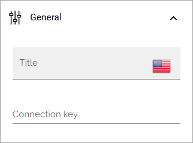

Analytics filters
=============================================

This is a block for Matomo analytics. Use it to set filters to be used in several Analytics widget and/or Analytics report blocks. If you're going to use just one widget block, the filter settings can be made there.

Pre requisite: To use Matomo analytics, the tenant feature “Analytics core setup” must be activated, and for a business profile, the feature “Create new analytics website in Matomo” must be activated. It's also important to start collecting analytics data as sooon as possible, as no historic data can be collected. For more information, see: :doc:`Analytics (Matomo) settings </admin-settings/business-group-settings/settings/analytics/index>`

The following settings are available for this block:

.. image:: analytics-block-78.png

General
---------
The following can be set under General:

+ **Connection key**: You can create a connection between this block and one or more Analytics widget blocks and/or Analytics report blocks. This is how you can use this filter settings in several other blocks. Just type a suitable connection key.

Display
---------
Under Display you set up the filters.

+ **Period**: Decide if you want to display period, and if you do, select period in the list.
+ **Period date**: Decide if you want to display period date, and if you do, select period date in the list.
+ **Properties**: Add the properties you want use here. Click the plus for a property you select to add it.
+ **No dimension filters**: This is just information. When no properties has been set up as dimensions, this message is shown.

Style
---------
The following settings are available for Style:

+ **Outlined**: Available in Omnia 7.8 and later. (A description will be added soon).
+ **Rounded**: Available in Omnia 7.8 and later. (A description will be added soon).
+ **Filled**: Available in Omnia 7.8 and later. (A description will be added soon).

Layout and Write
******************
The Write tab is not used here. The Layout tab contains general settings for blocks. For more information see: :doc:`General block settings </blocks/general-block-settings/index>`

