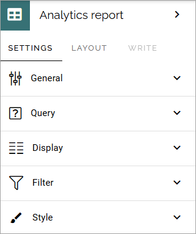
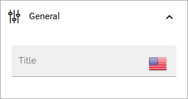
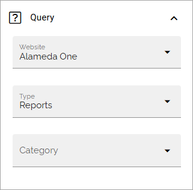
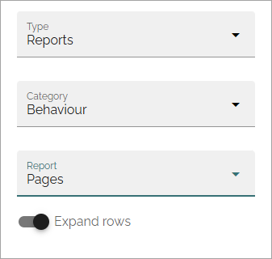
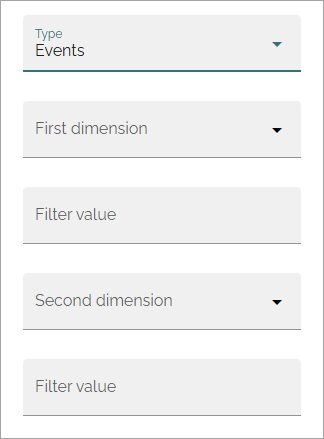
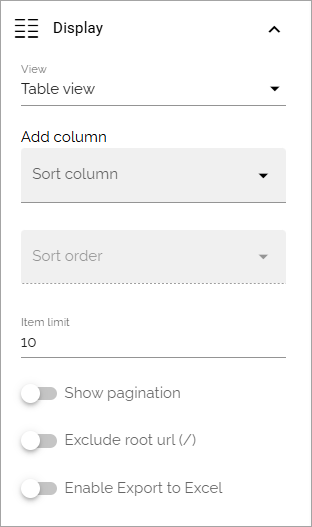
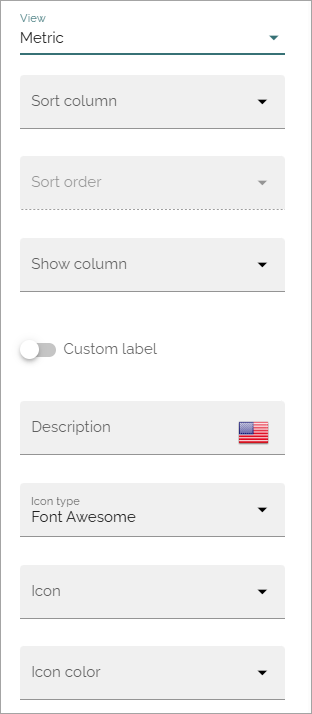
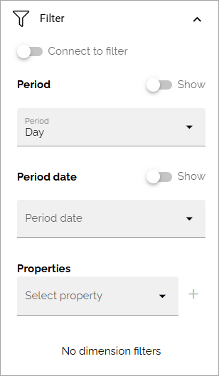
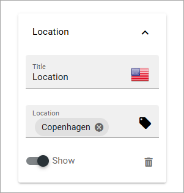
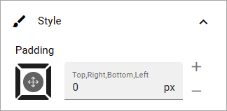

Analytics report in Omnia 7.8 and later
==========================================

This page describes the settings in Omnia 7.8 and later. See the following page for Omnia 7.7: :doc:`Analytics report </blocks/analytics-table-block/index>`

To be able to view the contents of the block, users need the permission "Analytics report viewers" (settings for the business profile).

Settings
*****************
The following settings are available for this block:

General
------------
Here, you can set a title for the block, if needed:

Query
---------
Here you select web site and type, and then the report you want to display in the block.

+ **Website**: Select the (Matomo) website to show analytics data for. In most cases, a "website" is the analytics data for a business profile.
+ **Type**: The type can be Reports or Events, meaning Matomo events.

**Options for Reports**: When you have selected "Reports" as type, you select a category and then the report you would like to display in the block.

+ **Expand rows**: This option is similar to the "Make flat" option in Matomo. Select the option to display the subtable, if any. (If you select the option and there's no difference, no subtable is available).

**Options for Events**: Matomo events makes it possible to track certain actions, in detail or grouped. A few examples of what can be tracked are when comments are added, when a page is shared or when a form is created.

When you have selected "Events" as type, the following settings are available:

+ **First dimension**: Select "Event categories", "Event actions" or "Event names".
+ **Filter value (First field)**: Here you can add a filter value for the first dimension, from "Event categories", "Event actions" or "Event names" in Matomo.
+ **Second dimension**: Select what should be displayed as a second dimension. Not mandatory. Basically, the second dimension can be any of the two options you did'nt select as first dimension. 
+ **Filter value (second field)**: If you have chosen to display a second dimension, you can add a filter value from Matomo here.

For more information about Matomo event tracking, see: :doc:`About Matomo event tracking </general-assets/about-matomo-event-tracking/index>`

Display
-------------
Here you choose Table view or Metric. The following settings are available for Table view:

And the folllowing for Metric:

Description of all options below:

+ **Add column**: For Table view only. You must add at least one column for Table view to work.
+ **Sort column**: Select the column to sort on.
+ **Sort order**: Select Ascending or Descending sort order.
+ **Show column**: For Metric only. 
+ **Custom label**: A custom label for the metric can be added here.
+ **Item limit**: If you just want to display a certain number of items, add a number here. For no limit, keep the field empty.
+ **Show flat**: Select this option to instruct Matomo API to return data in a flat structure. This is something you normally should do in Omnia. For more information about this Matomo feature, use ChatGPT.
+ **Show pagination**: For Table view only.
+ **Custom label**: To add a custom label to the metric, select this option and add the label in the field that is shown.
+ **Description**: For Metric only. To add a description for the metric, use this field.
+ **Icon type, Icon, Icon color**: To display an icon for the metric, select type and then icon. You can also choose another color for the icon.
+ **Show pagination**: For table view only. The number of "pages" for the report is shown at the bottom, for navigation purpose.
+ **Exclude root URL (/)**: If the root URL, usually the start page of the intranet, should not part of the analytics display, select this option. 
+ **Enable export to Excel**: Select this option to add a button users can click to export the report to Excel.

A note on the metric "Visitor frequency": This is the ratio between visits and unique visitors.

Filter
--------
The following filter settings are available for this block:

+ **Connect to filter**: An anlytics report block kan be connected to one or more widget blocks to use the filters set up in the Analytics filter block. If you want to use the filters from an Analytics filter block here, select this option and add the connection key from that block.Then you don't need to set any filter settings in this block. If don't select this option, you can add filter settings for this block, as shown in the image. 
+ **Period**: Period can be day, week, month or year.
+ **Period date**: Here you set details for the period. Note that you can add custom settings, see this page for more information: :doc:`Custom date filtering </general-assets/custom-date-filtering/index>`
+ **Properties**: This list can be used to add dimension filters the users can filter on. Select one or more properties and then edit the settings. See below for an example.

Decide which filters to display, by selecting "Show" to activate a filter.

(The message "No dimension filters" are always shown when no properties/dimension filters has been added).

Here's an example of a dimension filter property setting:

Style
------
Not much to it here. You can set some padding if needed.

Layout and Write
******************
The Write tab is not used here. The Layout tab contains general settings for blocks. For more information see: :doc:`General block settings </blocks/general-block-settings/index>`

