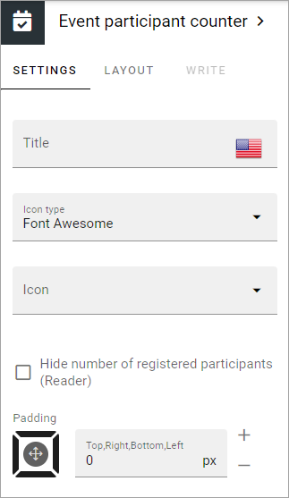

Event participant counter 
=================================

This block is used to show the number of participants that has registered for the event and the number of possible participants. 

This page describes the settings in Omnia 7.11 and earlier. Settings in Omnia 7.12 and later are a bit different, see: :doc:`Event participant counter in Omnia 7.12 </blocks/blocks-event-management/participant-counter-712/index>`

Here's an example when an Event is fully booked:

.. image:: event-management-counter.png

**Important note!** Event editors/admins can join events even though the max limit of participants has already been reached. The result can be that the number of registered participants seems to be higher than the max limit. If available seats in the image above would have been 21/20, it would simply have meant that an editor/admin also had joined the event.

Settings
*********
The following settings are available for the block:

+ **Title**: Here you can add a title for the block. 
+ **Icon type**: Select an Icon Type here.
+ **Icon**: Choose the Icon in the icon type you have selected.
+ **Hide number of registered particpants (reader)**: Select this option if the number of participants should not be shown for users with Reader permission (Event admins can still see it).
+ **Padding**: If some padding is needed between the block edges and the list, add it here.

Layout and Write
*********************
The WRITE TAB is not used here. The LAYOUT tab contains general settings, see: :doc:`General Block Settings </blocks/general-block-settings/index>`

