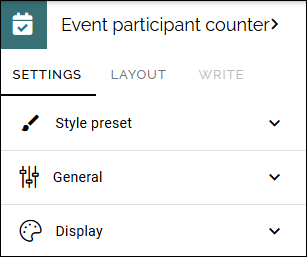
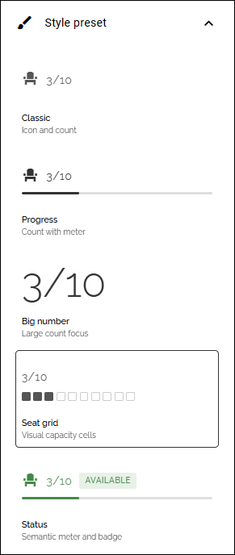
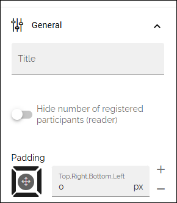
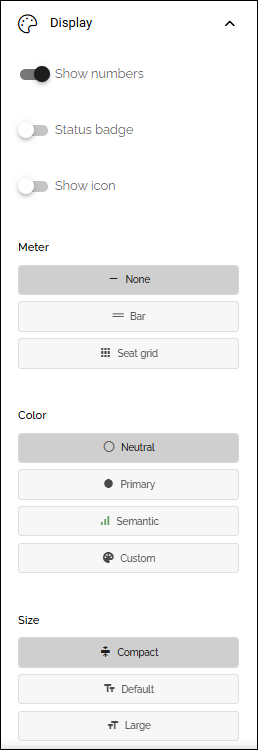

Event participant counter in Omnia 7.12
========================================

This block is used to show the number of participants that has registered for the event and the number of possible participants. 

This describes the settings in Omnia 7.12 and later. For Omnia 7.11 and earlier, see: :doc:`Event participant counter </blocks/blocks-event-management/event-participant-counter/index>`

**Important note!** Event editors/admins can join events even though the max limit of participants has already been reached. The result can be that the number of registered participants seems to be higher than the max limit. If available seats in the image above would have been 21/20, it would simply have meant that an editor/admin also had joined the event.

Settings
*********
The following settings are available for the block in Omnia 7.12 and later:

Style preset
-------------
Here you can preview the style preset, for example:

(The whole preset is not shown in the image aboove).

General
--------
In the general settings, you can add a title, choose to not display number of registered participants for users with Reader permission (event administrators can still see it).

Display
---------
Here you can edit some display settings. Should be self explanatory.

Layout and Write
*********************
The WRITE tab is not used here. The LAYOUT tab contains general settings, see: :doc:`General Block Settings </blocks/general-block-settings/index>`

