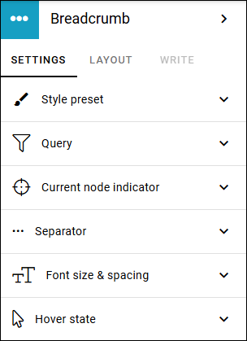
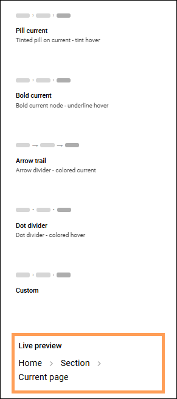
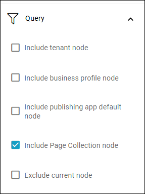
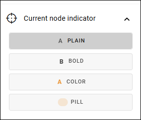
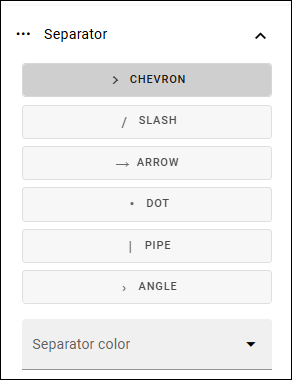
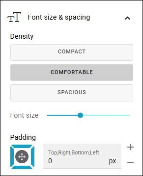
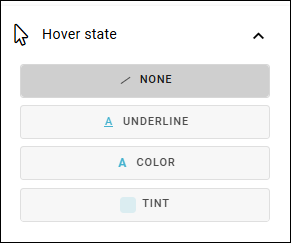

Breadcrumb settings for Omnia 7.12
=====================================

This page describes the settings for the Breadcrum block in Omnia 7.12 and later. 

For Omnia 7.11 and earlier, see: :doc:`Breadcrumb </blocks/breadcrumb/index>`

The breadcrumb block makes it possible for end user to navigate to any parent node of the current page in the navigation structure.

For physical pages, that is not part of the navigation structure (for example news articles), it will show the welcome page of the current publishing sites as the parent node.

Settings for the block
************************
The following settings are available for the Breadcrumb block in Omnia 7.12 and later:

Style presets
-------------
At the top you can select a style preset as a starting point.

A preview of the selected style is shown below the presets, here:

Query
--------
Here you can set:

Decide if the title for the tenant, business profile, publishing app and/or the page collection should be shown. Also decide if the current node should be shown or not. See links for settings below.

Current node indicator
-----------------------
How should the current (active) node be indicated? That's what you set here.

Separator
------------------
Choose type of separator and separator color here.

Font size and spacing
-------------------------
Here you find settings for the text font.

Hover state
---------------
Set how hovering over a node should be indicated.

Read more
****************
For more information about the tenant title, see: :doc:`Settings (Tenant) </admin-settings/tenant-settings/settings/index>`

For more information about the business profile title, see: :doc:`Business profiles </admin-settings/tenant-settings/business-profiles/index>`

For more information about how to change a publishing app's title, see: :doc:`Publishing </admin-settings/business-group-settings/publishing-apps/index>`

For more information about page collection title, see: :doc:`Page collection settings </pages/page-collections/page-collection-settings/index>`

Layout and Write
*********************
The WRITE TAB is not used here. The LAYOUT tab contains general settings, see: :doc:`General Block Settings </blocks/general-block-settings/index>`

