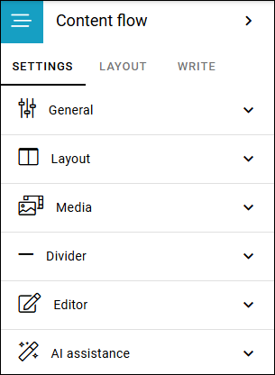

Content builder
==================

**Work on this page is just started. More information will be added soon.**

This block is an authoring tool. It can be used instead of a text block and the RTF editor. Available in Omnia 7.12 and later.

It should be easier and faster to create and edit content with the content builder. With that said it isn't a full replacer of the RTF editor, it's another way of working with content. And you can of course use both if you choose to do that.

Page types can be created for content flow, for consistent look and feel. See this page for more information: (link to be added).

This page describes the settings for the block. For information on how to use the conent builder's all options, see: (link to be added)

The following settings is available:

(Will be continued ver soon)

