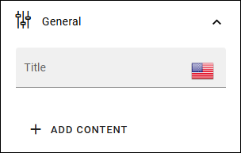
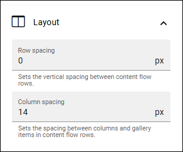
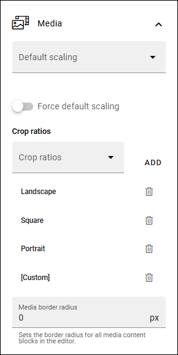
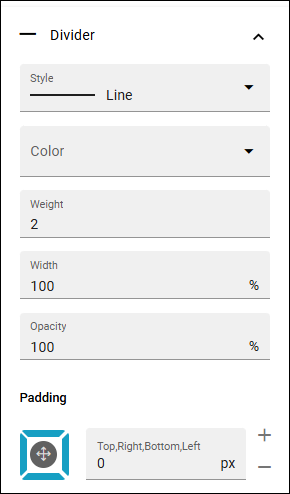
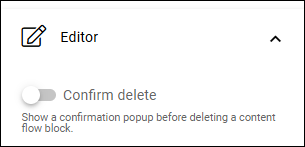
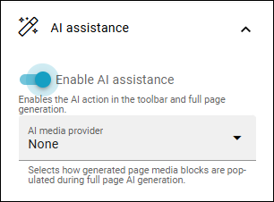

Content builder
==================

**Work on this page is just started. More information will be added soon.**

This block is an authoring tool. It can be used instead of a text block and the RTF editor. Available in Omnia 7.12 and later.

It should be easier and faster to create and edit content with the content builder. With that said it isn't a full replacer of the RTF editor, it's another way of working with content. And you can of course use both if you choose to do that.

Page types can be created for content builder, for consistent look and feel, the same way as for pages with other blocks. See this page for more information: :doc:`Page types </pages/page-types/index>`

This page describes the settings for the block. For information on how to use the conent builder's all options, see link below

The following settings are available:

.. image:: content-builder-settings-all.png

General
********
Here you add a title for the block and add predefined content.

Content is added using the available options, described here: :doc:`Using Content builder </general-assets/using-content-builder/index>`

Layout
*******
Row spacing and column spacing for the block can be set here:

Media
*****
Here the settings for media are available:

Divider
********
Settings for divider lines can be edited here:

Should be self explanatory.

Editor
**********
You can choose that a confirmation should be needed, before the block is deleted.

If not activem the block will be deleted directly, as it is with most other blocks.

AI assistance
*****************
Choose if AI assistance should be available for this block.

Using AI an author can choose to let the AI create all content. Not mandatory of course.

When enabled, you must select the AI media provider.

