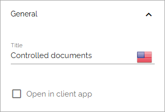
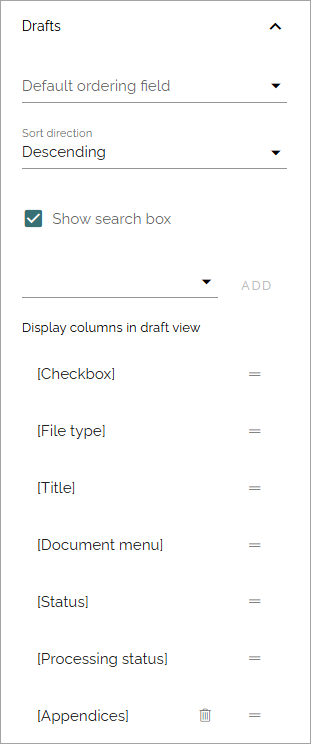
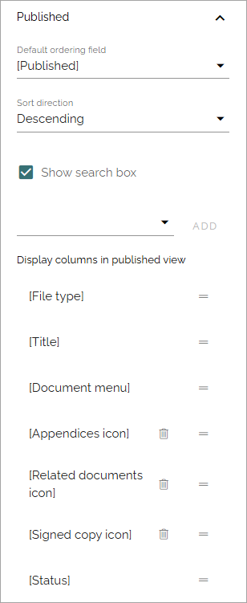
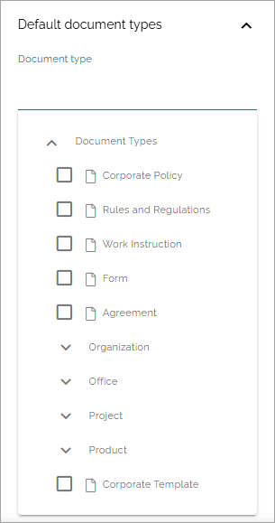

Controlled documents library block
=====================================

**(This page is just started, will be worked on for a while).**

This block is simply the controlled documents library with all it's functionality, available as a block you can place on any publishing page or make available through a tab in Microsoft Teams. The block is available in Omnia 7.7 and later.

Just be aware that the block will need the full page width.

For more information about the controlled documents functionality, see: :doc:`Working with documents </working-with-documents/index>`

Settings
***********
The following settings are available for the block:

General
---------
This is available here:

+ **Title**: You can add a title for the block here, if needed.
+ **Open in client app**: Select this option if the documents should be opened in the client app instead of online.

Display
------------
These display settings are available for the block:

.. image:: contr-document-libr-block-settings-display.png

+ **Default tab**: Choose which tab should be the default tab (automatically opened when a user enters the page.
+ **Paging**: You can set No paging, Classic or Scroll.
+ **Page size**: Select the number of documents to be listed for each "page" (meaning in the documents list).
+ **Padding**: Set some padding if needed.
+ **Hide tasks tab**: If the tasks should not be shown, select this option.

Drafts
-------
For the Drafts tab, the following settings are available:

(Info will be added soon).

Published
--------------
For the Published tab, the following settings are available:

(Info will be added soon).

Default document types
--------------------------
Here you can selevt one or more document types to be the default ones when creating a controlled document.

Just click in the field to open the list:

(Info will be added soon).

