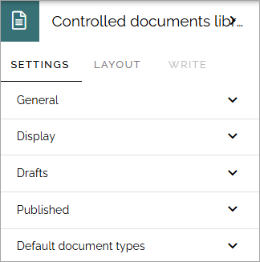

Controlled documents library block
=====================================

**(This page is just started, will be worked on for a while).**

This block is simply the controlled documents library with all it's functionality, available as a block you can place on any publishing page or make available through a tab in Microsoft Teams. The block is available in Omnia 7.7 and later.

Just be aware that the block will need the full page width.

For more information about the controlled documents functionality, see: :doc:`Working with documents </working-with-documents/index>`

Settings
***********
The following settings are available for the block:

The settings are exactly the same, and works the same, as described on this page: :doc:`Controlled documents library settings </working-with-documents/controlled-documents-library-settings/index>`

(Permissions described on that page do not apply when using Controlled documents library as a block, then the page's permissions apply).

