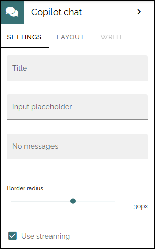

Copilot chat
===================

**Important note!** This block is to be considered experimental for now. It will be developed further soon.

Use this block for experimental Copilot chats. The primary purpose is to interact with Copilot in the same way you would across Microsoft 365 applications, enabling general conversations, brainstorming, and assistance beyond searching for information within Omnia.

Prerequisites
**************
For this block to be available, the tenant feature "Experimental - Copilot chat" must be active. The block must also be added to one or more of the block dialogs.

For more information on block dialogs, see the heading "Block dialog" on this page: :doc:`Block gallery </admin-settings/tenant-settings/block-gallery/index>`

Settings
**********
The following settings are available:

+ **Title**: A title for the block can be added.
+ **Input placeholder**: If you would like another text than "Message Copilot" as seen in the input field, add the text here.
+ **No messages**: Before any chat is started, the message "Welcome, how can I help?" is shown. If you would like some other message there, add it to this field.
+ **Border radius**: This settings changes the shape of the input field.
+ **Use streaming**: If this option is **not activated**, Copilot will work until the complete answer is finished, and will then show it. If this option is **activated** Copilot will show partial answers while it's working, meaning users will see answers poping up faster, but it will still take time before the complete anwer is shown.

Layout and Write
******************
The Write tab is not used here. The Layout tab contains general settings for blocks. For more information see: :doc:`General block settings </blocks/general-block-settings/index>`
