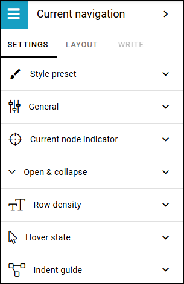
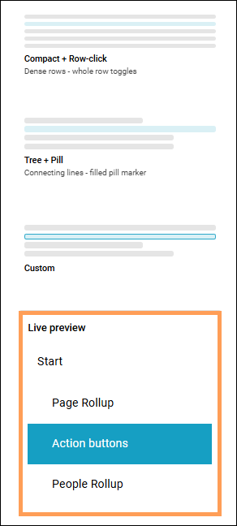
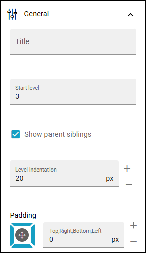
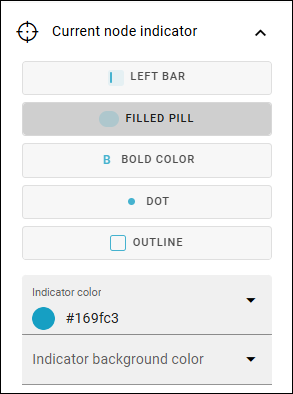
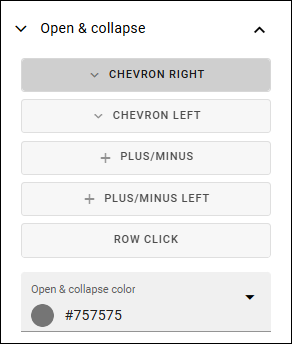
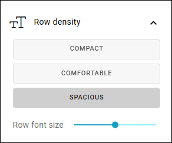
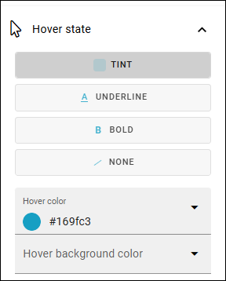
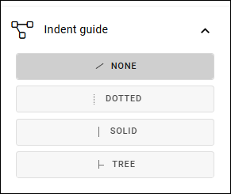

Current navigation in Omnia 7.12
==================================

This page decsribe the settings for the Current navigation block in Omnia 7.12 and later. For 7.11 and earlier, see: :doc:`Current navigation </blocks/current-navigation/index>`

The current navigation can be set to be shown, as most blocks can, in all or some of the three display breakpoint settings, available when the block is edited; Extra small, Small, Medium or Large. See the heading "Display settings for blocks" on this page for more information: :doc:`Working with blocks </blocks/working-with-blocks/index>`

**Note!** Text color from the Theme settings are not used here.

The settings
*************
These settings are available in Omnia 7.12 and later:

Style presets
-------------
At the top you can select a style preset as a starting point.

A preview of the selected style is shown below the presets, here:

General
--------
Here you can set:

+ **Title**: If you would like a title to be shown for the block, add the title here. 
+ **Start level**: The current navigation will start on a specific level in the navigation structure. 1 = Start, 2 = Second level, 3= Third level etc. The default value is 3.
+ **Show parent siblings**: To always show all main nodes, select this setting. If not selected, only the current node is shown. See below for examples.
+ **Level indentation**: Set the indendation for each level shown here.
+ **Padding**: Use this option to set a padding for the navigation, within the block.

Current node indicator
-----------------------
How should the current (active) node be indicated? That's what you set here.

Open & collapse
------------------
This section contains settings for opening and collapsing main nodes that contain sub nodes.

Row density
------------
Here you find settings for the density of the text for rows in navigation, and for the size of the text for the nodes.

Hover state
---------------
Set how hovering over a node should be indicated.

Indent guide
--------------
Finally, you can set the indentation for sub nodes, or choose not to indent.

Layout and Write
*********************
The WRITE TAB is not used here. The LAYOUT tab contains general settings, see: :doc:`General Block Settings </blocks/general-block-settings/index>`

