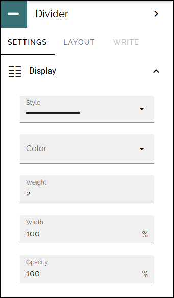
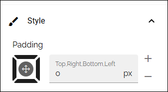

Divider
==========

In Omnia 7.12 and later, a divider block is available. The purpose is simply to to be able to create dividers on a page, if needed.

Display
-------
Use this section to select details for the devider.

Weight is the thickness of the divider. Regarding Opacity, 100% is no opacity and 0% is full opacity.

Style
------

Here some padding can be set.

