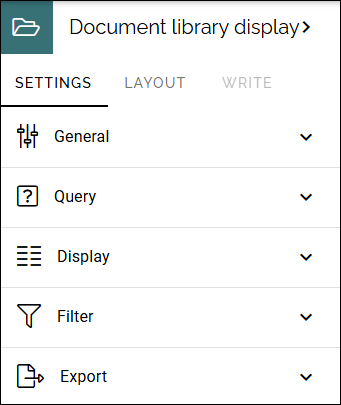
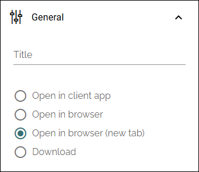
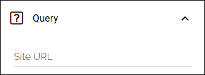
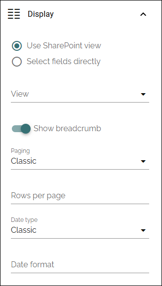
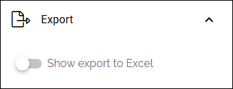

Document library display
==========================

Available in Omnia 7.12 and later.

**This is a preliminary description. Will be edited soon.**

Use this block to display the folder structure for a SharePoint document library, to make it possible to open a document from the folder or any sub folder.

Settings
*********
The following settings are available:

General
----------
Add a title for the block if needed, and decide how a document that is opened from the list should be opened.

Query
-------
Add the URL to the document library here:

Display
---------
For Display the following settings are available:

+ **Use SharePoint view**: To display the result in an existing SharePoint view, select the view from the list.
+ **Select fields directly**: If there isn't any suitable view available, you can instead select the fields for the list.
+ **Show breadcrumb**: Select to show a breadcrumb for the folders.
+ **Paging**: Select "No paging" or "Classic".
+**Rows per page**: The default settings is 50. Can be edited.
+ **Data type**: (A description will be added soon).

Filter
--------
Filter options are the same for almost all blocks, see: :doc:`Filter options for blocks </blocks/general-block-settings/filter-options-block/index>`

Export
-------
You can decide that export till Excel will be available for end users:

