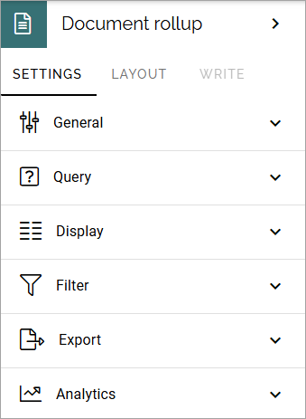
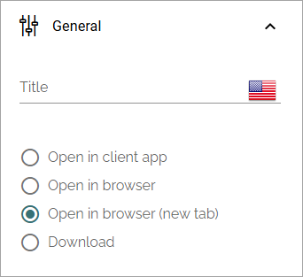
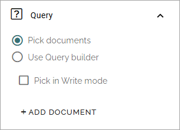
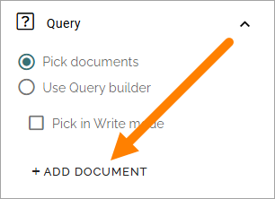
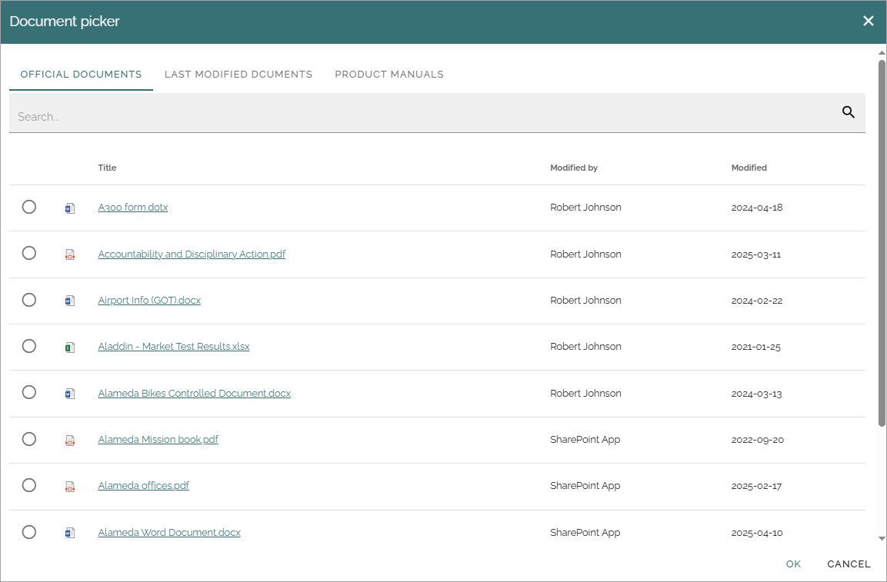
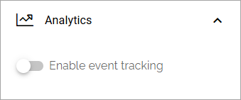
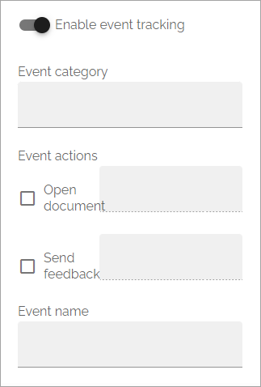

Document rollup
===========================================

Using The Document rollup block you can display suitable documents in a list. 

For implementation examples, see this page: :doc:`Document rollup implementation examples </blocks/document-rollup/document-rollup-implementation/index>`

Settings
*************************
The following settings are available:

The Analytics options can be available in Omnia 7.8 and later, if Matomo analytics is active in the tenant. More info at the bottom of the page.

General
-----------------
Here you can add a titel if needed, and choose how a document should be opened from the rollup:

+ **Title**: If a title should be shown for the block, add it in this field. 
+ **Open in client app**: Documents are by default opened in the online app. If document should be opened in the client app instead, select this option.

Query
---------
You can either choose to pick documents to be displayed in the block, or use the Query Builder.

.. image:: document-rollup-query-new2.png

Pick documents
^^^^^^^^^^^^^^^^^
You can pick a number of documents to be displayed in the rollup. In Omnia 7.10 and later you can also allow authors to pick documents in Write mode. 

To pick documents, click "ADD DOCUMENT".

The document picker opens and you use it to select documents. Available filters etc depend on settings in Omnia Admin. Here's an example:

See this page for more information on how to use the document picker: :doc:`The Document picker </general-assets//document-picker/index>`

Query builder
^^^^^^^^^^^^^^
Here you add queries, which is the detailed "settings" for what to display in the list:

1. Set scope for the document rollup: 

.. image:: document-rollup-settings-query-scope-new2.png

+ **All documents**: Always available, meaning ALL documents the logged in user has permissions to read. Use the query settings below to limit what will be shown in the rollup. The rollup can then be set to display just standard documents or both standard and controlled documents. To rollup documents from one or more teamsites, use this option.
+ **Published documents**: Available only if the feature Controlled documents is active. Meaning all published controlled documents the logged in user has permissions to read. Use the query settings below to limit what will be shown in the rollup.
+ **Archived documents**: Available only if the feature Controlled documents is active. Meaning all published controlled documents in the archive. As permissions to read documents in the archive normally is given to just a few. This is for specialized implementations.
+ **Process documents**: Available in Omnia 7.8 and later. Available only if the feature Process managament is active. See below for more information. 
+ **Sharepoint library**: Available in Omnia 7.8 and later. You can choose to rollup all documents from a specific SharePoint library. When you have selected this option for the query, add the URL to the library in the field shown.

**Note!** Regardless of what you select here, the documents that will be displayed for a user are only those documents that the user has premissions to read.

2. Use the three lists for base settings and the field to add a query parameter. 

.. image:: document-rollup-settings-query-scope-settings.png

3. Click "Add" to add the Query. 

Note that you can type the script directly in the field, if you know how. You can use all options in the Keyword Query Language (KQL). See this Microsoft page for reference: https://docs.microsoft.com/en-us/sharepoint/dev/general-development/keyword-query-language-kql-syntax-reference

Additionally you can set:

.. image:: document-rollup-settings-query-scope-settings2.png

+ **Day limit**: Use this option to limit the display of older documents. You first select property (for example Modified) and then select how old the documents can be to be displayed in the list.
+ **Last modified by current user**: Use this option to limit the rollup to documents the logged in user has edited, for example for a "My latest documents" implementation.

Rolling up process documents
^^^^^^^^^^^^^^^^^^^^^^^^^^^^^
Available in Omnia 7.8 and later. Using the query option "Process documents" you can rollup controlled documents that have been added to a process. This is meant to replace the Process documents block for the same purpose as that block was used.

The primary usage is in a template for process pages. To list any documents a Process context block must be added to the same page so the document rollup "knows" which process to get the documents from.

Custom date filtering
^^^^^^^^^^^^^^^^^^^^^^^^^^
If the scope is filtered on some kind of time property, custom date filtering can be set.

See this page for more information about custom date filtering: :doc:`Custom date filtering </general-assets/custom-date-filtering/index>` 

A tip - rolling up drafts
^^^^^^^^^^^^^^^^^^^^^^^^^^
If you would like to rollup all controlled document drafts in the whole tenant, here's how.

1. Use Query builder.
2. Select "All documents".
3. Add the following KQL: ODMIsPublishedOWSBOOL:0 AND ODMIsPreviewOWSBOOL:0

Like this:

.. image:: rollup-drafts.png

Other filters can of course be used, for example to rollup all draft documents for a specific author or regarding a specific product, as long as you remember to select "All documents".

Display and filter settings are done the usual way.

Display
---------------
You can select "List view", "Summary view", "Group by site" and "Card" here. Available settings differ.

For **List view** you can set the following:

.. image:: document-rollup-settings-display-new3.png

+ **Add column**: Select the columns to show in the list. Note! If users should be able to send feedback on controlled documents, add the column "Feedback icon". An information icon can also be very useful as it displays more information about the document.
+ **Fixed header**: The header of the rollup can be shown all the time (Fixed). If you want that, select this option.
+ **Trim by following sites**: If this option is selected only documents from sites the logged in user follows are displayed in the list.
+ **Sort by**: Select the column the list should be sorted by.
+ **Paging**: Select paging for the list here. It can be "No paging", "Classic" or "Scroll".
+ **Item limit**: Shown when No paging is selected. Set the item limit to display in each "page" of the list.
+ **Page size**: Shown when Classic or Scroll paging is selected. Set the item limit to display in each "page" of the list.
+ **No result text**: If a specific text should be displayed when the query comes up empty, add the text here.
+ **Padding**: Use this setting for padding around the contents in the block.

If you select "Adjust columns" - displayed when you have selected columns - you can set the width for the columns, if needed:

.. image:: document-rollup-settings-display-width.png

For **Summary view** these settings are available:

.. image:: document-rollup-settings-summary-view.png

+ **Title**: Select property to to get the title from.
+ **Modified at**: Select the property to get this information from.
+ **Modified by**: Select the property to get this information from.
+ **Trim by following site**: If this option is selected only documents from sites the logged in user follows are displayed in the list.
+ **Sort by**: Select the column the list should be sorted by.
+ **Paging**: Select type of paging here; No paging, Classic or Scroll.
+ **Item limit**: Shown when No paging is selected. Set the item limit to display in each "page" of the list.
+ **Page size**: Shown when Classic or Scroll paging is selected. Set the item limit to display in each "page" of the list.
+ **No result text**: If a specific text should be displayed when the query comes up empty, add the text here.
+ **Padding**: Use this setting for padding around the contents in the block.

For **Group by site** these settings are available:

.. image:: document-rollup-settings-display-group-new2.png

+ **Title**: Select property to to get the title from.
+ **Modified at**: Select the property to get this information from.
+ **Modified by**: Select the property to get this information from.
+ **Always show letter avatar**: If letter avatars always should be shown, select this option.
+ **Trim by following site**: If this option is selected only documents from sites the logged in user follows are displayed in the list.
+ **Sort by**: Select the column the list should be sorted by.
+ **Item limit**: Set the item limit to display in each "page" of the list.
+ **No result text**: If a specific text should be displayed when the query comes up empty, add the text here.
+ **Padding**: Use this setting for padding around the contents in the block.

For **Card** view the following settings are available:

.. image:: document-rollup-settings-display-card-new3.png

+ **Title**: Select property to to get the title from.
+ **Modified at**: Select the property to get this information from.
+ **Modified by**: Select the property to get this information from.
+ **Show modified by info**: If it should be shown who the latest version of this document was created by, select this option.
+ **Show action buttons**: Makes the following options available in a menu: "Copy link" and "Source library".
+ **Trim by Following Site**: If this option is selected only documents from sites the logged in user follows are displayed in the list.
+ **Sort by**: Select the column the list should be sorted by.
+ **Paging**: Select paging for the list here. It can be "No paging", "Classic" or "Scroll".
+ **Item limit**: Set the item limit to display in each "page" of the list.
+ **No result text**: If a specific text should be displayed when the query comes up empty, add the text here.
+ **Padding**: Use this setting for padding around the contents in the block.

For Card view, you can also edit card spacing, available under STYLES:

.. image:: document-rollup-settings-display-card-style.png

Filter
--------
Filter options are the same for almost all blocks, see: :doc:`Filter options for blocks </blocks/general-block-settings/filter-options-block/index>`

Export
*********
Use this settings to display a link for export of the list to Excel.

.. image:: document-rollup-export.png

+ **Add column**: Available in Omnia 7.8 and later. Use this option to add the columns for the Excel file. Only the URL is default. You need to add all other columns you need.

Analytics
************
It can be possible to use Matomo event tracking for documents, through a document rollup. It can be available in Omnia 7.8 and later, if analytics is active in the tenant. Also note that analytics data collecting must be on for the business profile for this to work, see the link to the analytics settings below.

If activated, the following settings are available:

As you can see, what you can track is if a document in the rollup is opened and if a user sends feedback for a document.

To display data for event tracking, use the query type "Event" in the Analytics report block.

For more information about how Matomo event tracking works and how to use the settings, see: :doc:`About Matomo event tracking </general-assets/about-matomo-event-tracking/index>`

Some settings are needed for every business profile where analytics data should be collected. Read about that here: :doc:`Analytics (Matomo) settings </admin-settings/business-group-settings/settings/analytics/index>`

Layout and Write
*********************
The WRITE Tab is not used here. The LAYOUT tab contains general settings, see: :doc:`General block settings </blocks/general-block-settings/index>`

