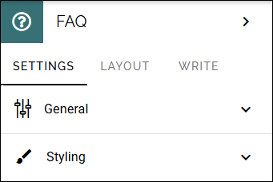
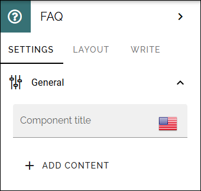
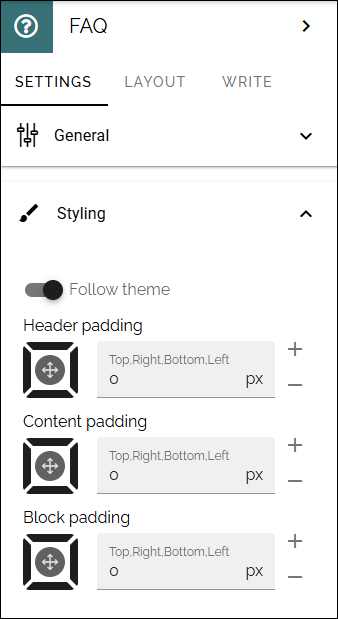
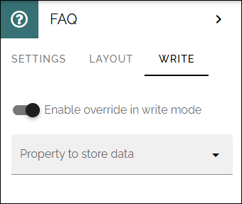
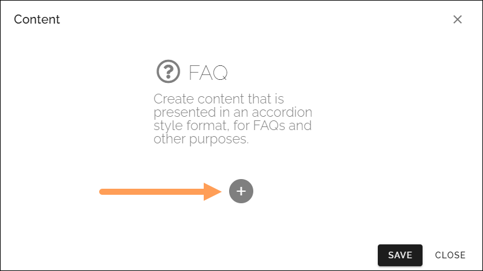
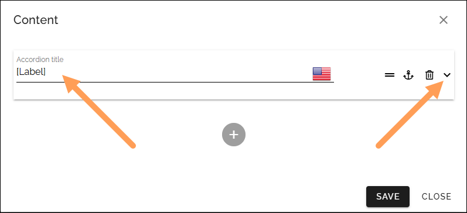
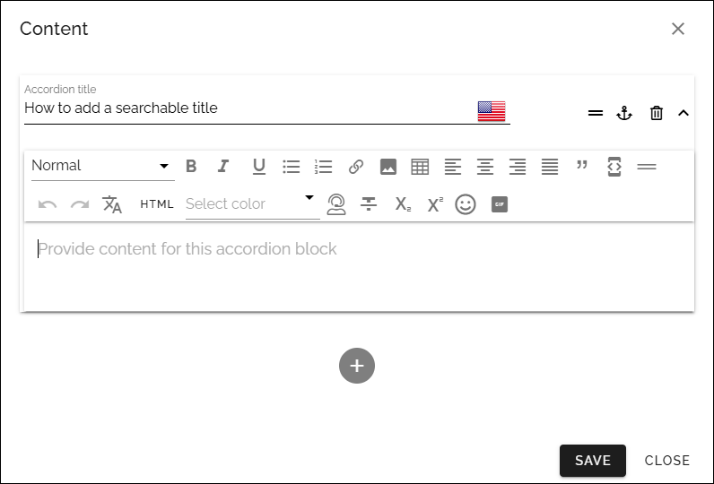
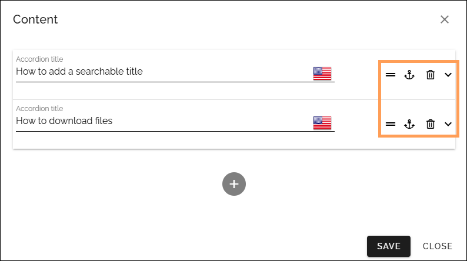

FAQ block
===========

In this block, you can create content that is presented in an accordion style format, for FAQ:s and other purposes. Note that there's an Accordion section available, for layout purposes. 

When there's no content in the block, it's completely hidden in read view. 

Settings
*********
The following settings are available:

General
----------
Under General, you will find the following settings:

+ **Title**: Add a title for the block, if needed.
+ **ADD CONTENT**: Click to add content. This can also be done in Write mode, if allowed. See below for more information.

Style
----------
Some styling options are also available:

LAYOUT and WRITE
********************
The LAYOUT tab contains general settings, see: :doc:`General block settings </blocks/general-block-settings/index>`

The following settings are available on the WRITE tab:

+ **Enable overwrite in Write mode**: Select this option if it should be possible to create and edit FAQ:s using Write mode.
+ **Property to store data**: Select property for the possibibilty to reuse content anywhere else on the page.

Adding content to the block
*****************************
Adding content to the block works the same if you do that in the settings (Design mode) or in Write mode. Do the following:

1. Click the plus.

2. Add a title at the top. This is the expandable text. Then click to expand.

3. Add the text that should be shown when the title is expanded. Note the formatting options.

Also note that you can add an anchor for each post. For more information about anchors, see this page: :doc:`Using Anchors </general-assets/using-anchors/index>`

4. Click SAVE.
5. Add additional FAQ:S to the block the same way.

Editing content
****************
When you have added a few FAQ posts you can use the icons this way to edit:

To edit, expand the FAQ. To delete, click the dust bin. You can also decide the order by using the left-most icon to drag and drop. Use the anchor to add or edit an ancho.

