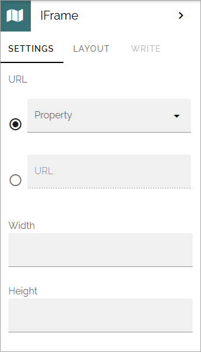

IFrame block
===============

The block can be used to show contents in an iFrame. The block is also an important part of the Share document functionality.

Settings
**********
The following settings are available:

You can use the top field to add a property type Data for documents, when setting up the Share document functionality.

The second field you can use to add an URL to content to display in the iFrame. You can also set width and height for the block.

You can find more information about the Share document functionality here: :doc:`Share documents </general-assets/share-document/index>`

Use the iFrame block on a section tab
********************************************
There is a known problem that may occur when using the iFrame block on a section tab.You may have to disable lazy load, or the block won't work. This will eventually be fixed, but, for now, if you encounter this problem, simply disable lazy load. And to make sure, disable lazy load on all sections on the same levels as well, even if they don't contain an iFrame block.

This settings is found under "Advanced" in the settings for the section. For more information, see: :doc:`Settings for sections </pages/page-types/section-settings/index>`
