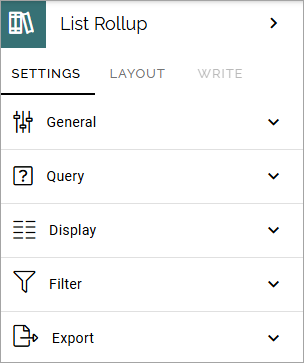

List rollup
===================================

Available in Omnia 7.10 and later. Use this block to rollup data from SharePoint lists, especially custom lists. You can also aggregate data from several SharePoint lists for the rollup, using the query builder.

Settings
***********
These settings are available for the block:

More will be added to this description soon.

General
---------
As for most blocks, you can add a block title here if needed:

.. image:: list-rollup-general.png

Query
------
Decide to use the query builder or to just pick a single list. Here's the option for "Use query builder". You use it in a similar way to other Omnia rollups.

.. image:: list-rollup-query-query-new.png

If you decide to choose only one list, add the URL to the list here:

.. image:: list-rollup-query-list-new.png

Display
--------
For now, only List view is available. Note that you must still select "List view", even as there is just one option. Here's the available settings for List view:

.. image:: list-rollup-display-new.png

Filter
-------
Filtering options are similar to other Omnia rollups.

.. image:: list-rollup-filter-new.png

For more information about filtering for blocks, see: :doc:`Filter options for blocks </blocks/general-block-settings/filter-options-block/index>`

Export
--------
Export to Excel can be available for users, if you select this option.

.. image:: list-rollup-export-new.png

When Export to Excel is active, you can set how the rows should be sorted. 

You can also add columns as aaddion(s) to the standard columns. New columns are placed to the right. If you have added several extra columns, you can select ""Adjust columns" to set the order (left to right) among the new columns.

.. image:: list-rollup-export2.png

