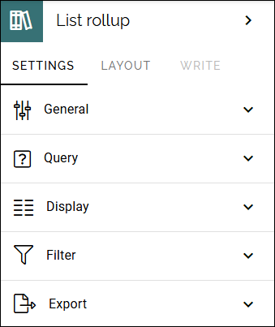
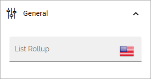
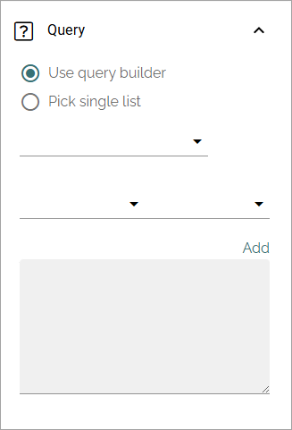
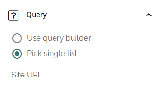
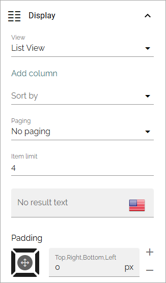
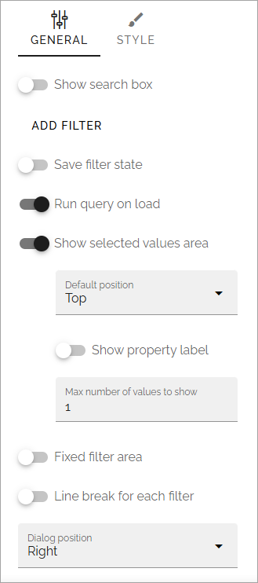
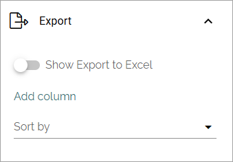
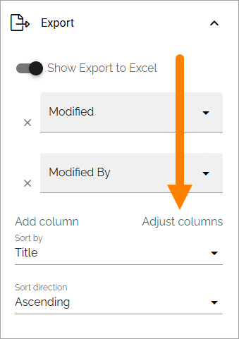

List rollup
===================================

Available in Omnia 7.10 and later. Use this block to rollup data from SharePoint lists, especially custom lists. You can also aggregate data from several SharePoint lists for the rollup, using the query builder.

**Note!** A document library should not be used as a source to roll up data from, as it's a special type of library. Also note that SharePoint list formatting is not used.

Settings
***********
These settings are available for the block:

General
---------
As for most blocks, you can add a block title here if needed:

Query
------
Decide to use the query builder or to just pick a single list. Here's the option for "Use query builder". You use it in a similar way to other Omnia rollups.

Note that you can type the script directly in the field, if you know how. You can use all options in the Keyword Query Language (KQL). See this Microsoft page for reference: https://docs.microsoft.com/en-us/sharepoint/dev/general-development/keyword-query-language-kql-syntax-reference

In Omnia 7.11 and later, the "Contains" parameter can be used in the query.

If you decide to choose only one list, add the URL to the list here:

Display
--------
For now, only List view is available. Note that you must still select "List view", even as there is just one option. Here's the available settings for List view:

The following settings are available for the views:

+ **Add column**: This is not like columns in a table. You should think: What information do I want to display in the list? You must always add at least one column or nothing will be shown!
+ **Adjust columns**: Shown when adding columns. Use this option to set the order for the selected columns.
+ **Sort by**: Select the property to sort the list by.
+ **Paging**: Select how paging should work; “No paging”, “Classic” or “Scroll”. 
+ **Item limit**: To limit the number of items being displayed per "page", add a fixed number here. Works together with Paging. Also see the comment below.
+ **No result text**: If a specific text should be displayed when there's no items to show in the list, add the text here.
+ **Padding**: Use this option to add some padding between the list and the border of the block, if needed.

**Important note on "No paging"**: If you choose "No paging" and set "Item limit" to a specific number, that is the number of items that will be available in the list, regardless of how many that actually meets the search criteria.

Filter
-------
Filtering options are similar to other Omnia rollups.

For more information about filtering for blocks, see: :doc:`Filter options for blocks </blocks/general-block-settings/filter-options-block/index>`

Export
--------
Export to Excel can be available for users, if you select this option.

When Export to Excel is active, you can set sorting for the rows, using "Sort by". 

You can also add columns as addition(s) to the standard columns. New columns are placed to the right. If you have added several extra columns, you can select ""Adjust columns" to set the order (left to right) for the new columns.

