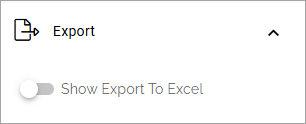

List rollup
===================================

**This page is just started. The info is preliminary.**

Available in Omnia 7.10 and later. Use this block to rollup data from SharePoint lists, especially custom lists. You can also aggregate data from several SharePoint lists for the rollup, using the query builder.

Settings
***********
These settings are available for the block:

.. image:: list-rollup-settings-all.png

More will be added to this description soon.

General
---------
As for most blocks, you can add a block title here if needed:

Query
------
Decide to use the query builder or to just pick a single list. Here's the option for "Use query builder". You use it in a similar way to other Omnia rollups.

If you decide to choose only one list, add the URL to the list here:

Display
--------
For now, only List view is available. Note that you must still select "List view" in the list, even there is just one option.

Filter
-------
Filtering options are similar to other Omnia rollups.

For more information about filtering for blocks, see: :doc:`Filter options for blocks </blocks/general-block-settings/filter-options-block/index>`

Export
--------
Export to Excel can be available for users, if you select this option.

