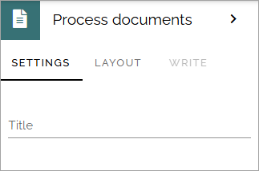

Process documents block
=========================

You use this block to display the documents relevant to the process, that was added on the Documents tab by the process author.

You can add a title for the block if nedded.

**Note!** There's a query option in the document rollup block, for rolling up controlled documents that have been added to a process. The recommendation is to use that block instead for this purpose.

For more informaion, see: :doc:`The document rollup block </blocks/document-rollup/index>`

Layout and Write
*********************
The WRITE Tab is not used here. The LAYOUT tab contains general settings, see: :doc:`General block settings </blocks/general-block-settings/index>`
