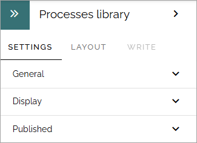

Process library
===================================

**This page is being edited.**

This block is simply the process library with all it's functionality, available as a block you can place on any publishing page or make available through a tab in Microsoft Teams. 

Just be aware that the block will need the full page width.

For more information about how to work with processes, see: :doc:`Working with processes </working-with-processes-v7/index>`

**Note!** Permissions works differently, see the comment below.

Settings
***********
The following settings are available for the block:

The settings are exactly the same, and works the same, as described on this page: :doc:`Processes library settings </working-with-processes-v7/processes-library-settings-v7/index>`

(Permissions described on that page do not apply when using the processes library as a block, then the page's permissions apply).

Layout and Write
**********************
The WRITE tab is not used here. The Layout tab contains general settings, see: :doc:`General block settings </blocks/general-block-settings/index>`

