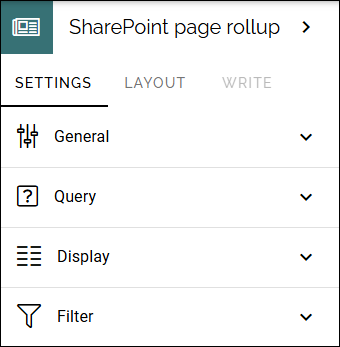
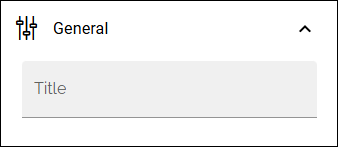
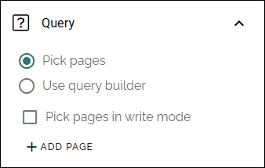
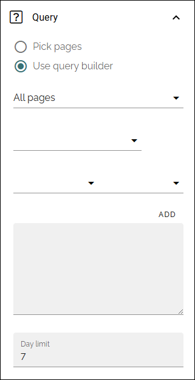
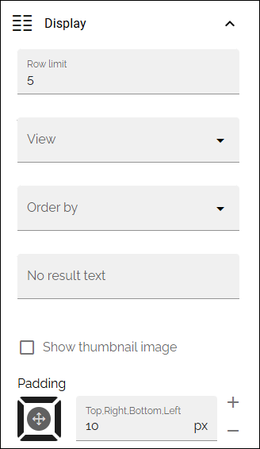
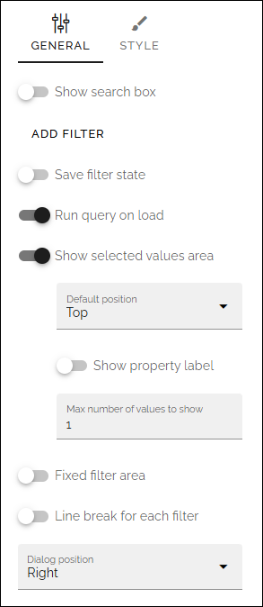

SharePoint page rollup
================================

In Omnia 7.12 and later, this block replaces Team news rollup.

**Work on this page has just started.**

The followig settings are availble:

Use this block to show team news for the logged in user. 

General
**********
Under General, you can add a title for the block:

Query
**********
You can either pick page or use the query builder.

Pick pages
--------------
If you choose to pick pages, the settings are the same as similar blocks:

+ **Pick pages**: To be able to pick some pages in Design mode, select this option.
+ **Pick pages in Write mode**: Select this option if authors should be able to pick pages in Write mode. **Note!** If you select this options, the ADD PAGE option is not available in the settings. 
+ **ADD PAGE**: When you have selected "Pick pages", you can pick some pages to always be displayed in the list. Click this option and use the SharePoint page picker. See this page for more information: (link to add)

Query builder
----------------
If you choose to use the query builder, you can choose to rollup all pages, with property filtering if needed, or rollup the pages in a specific SharePoint library:

(A description will be added soon).

+ **Day limit**: Use this settings for how old a news article should be to be displayed here. It's counted from the day it's published.
+ **Include legacy announcements**: If you're using the older Omnia solution for team announcements, select this option to show them here.
+ **Filter by followed sites**: If team news only from the sites the user follows should be shown, select this option.
+ **Filter by expiration date**: (A descirption will be added soon).

Display
---------
Here, the following can be set:

+ **Row limit**: Decide the number of rows to show for each "page" of the list.
+ **View**: Select view for the list; "List" or "Grouped by site".
+ **Order by**: Select what to sort the lists by.
+ **No result text**: If you would like a specific text to be shown when there are no news to display, add the text here, in any tenant language.
+ **Show thumbnail image**: If a thumbnail image should be shown for the news post, select this option.
+ **Padding**: You can add some padding between the list and the block border if needed.

Filter
---------
Here, the following can be set:

(A description will be added soon).

Layout and Write
**********************
The Write tab is not used here. The Layout tab contains general settings, see: :doc:`General block settings </blocks/general-block-settings/index>`

