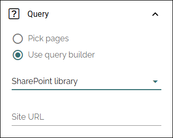
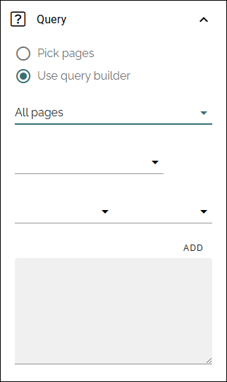
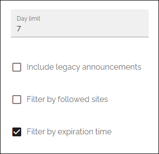

SharePoint page rollup
================================

In Omnia 7.12 and later, this block replaces Team news rollup.

**Work on this page has just started.**

The followig settings are availble:

.. image:: sharepoint-page-rollup.png

Use this block to show team news for the logged in user. 

General
**********
Under General, you can add a title for the block:

.. image:: sharepoint-page-rollup-general.png

Query
**********
You can either pick page or use the query builder.

Pick pages
--------------
If you choose to pick pages, the settings are the same as similar blocks:

.. image:: sharepoint-page-rollup-general-query-pick.png

+ **Pick pages**: To be able to pick some pages in Design mode, select this option.
+ **Pick pages in Write mode**: Select this option if authors should be able to pick pages in Write mode. **Note!** If you select this options, the ADD PAGE option is not available in the settings. 
+ **ADD PAGE**: When you have selected "Pick pages", you can pick some pages to always be displayed in the list. Click this option and use the SharePoint page picker. See this page for more information: (link to add)

Query builder
----------------
If you choose to use the query builder, you can choose to rollup all pages, with property filtering if needed, or rollup the pages in a specific SharePoint library:

.. image:: sharepoint-page-rollup-general-query.png

To rollup pages from a specific SharePoint library, add the URL to the site here, to list page libraries, and then select the library.

To rollup all, or a part of all pages:

Use the three lists for base settings and the field to add a query parameter. 

You use "Add" to add the settings to the Query field below. 

Note that you can type the script directly in the field, if you know how. You can use all options in the Keyword Query Language (KQL). See this Microsoft page for reference: https://docs.microsoft.com/en-us/sharepoint/dev/general-development/keyword-query-language-kql-syntax-reference

Additionally you can set:

+ **Day limit**: Use this settings for how old a news article should be to be displayed here. It's counted from the day it's published.
+ **Include legacy announcements**: If you're using the older Omnia solution for team announcements, select this option to show them here.
+ **Filter by followed sites**: If team news only from the sites the user follows should be shown, select this option.
+ **Filter by expiration date**: (A descirption will be added soon).

Display
---------
Here, the following can be set:

.. image:: sharepoint-page-rollup-general-display.png

+ **Row limit**: Decide the number of rows to show for each "page" of the list.
+ **View**: Select view for the list; "Card view", "Custom view", "Grouped by site" or "List".
+ **Order by**: Select what to sort the lists by.
+ **No result text**: If you would like a specific text to be shown when there are no news to display, add the text here, in any tenant language.
+ **Show thumbnail image**: If a thumbnail image should be shown for the news post, select this option.
+ **Padding**: You can add some padding between the list and the block border if needed.

Options for most views
------------------------
These options are available for most views, shown in different order for different displays, here listed in alphabetical order:

+ **Date**: Select the property that contains the date for the item(s) to display. Available for Roller, Listing with image, Dynamic roller, Card and Newsletter.
+ **Dialog image**: Select image to display, if any. Available when you have selected "Open page as a dialog".
+ **Fixed header**: Available for List view. When this option is selected, the heading will always be shown when scrolling.
+ **Hide block when no data**: Select this option if the block should be hidden when there's nothing to display.
+ **Hide if read**: Select this option to hide all pages the logged in user has visited. This affects all pages, including news.
+ **Highlight non-read**: This option makes sure non-read pages are highlighted. Default=selected. Deselect if you don't want that.
+ **Image**: Select the property that contains the image for the item(s) to display. Available for Roller, Listing with image, Dynamic roller, Card and Newsletter views.
+ **Image ratio**: Select ratio for the image; Landscape, Square or Wide. Available for Roller, Listing with image, Dynamic Roller and Newsletter.
+ **Link label**: Add the text to be shown for the link here. Available only if "Show link" is selected.
+ **Link URL**: Add the URL to open when a user clicks the link. Available only if "Show link" is selected.
+ **Max display limit**: Available only for scope Navigation path, for all views. Set the number of pages that should be displayed. 
+ **No result text**: Enter the text that will be shown if no page can be displayed.
+ **Open in editor**: If this option is selected, a page link can be clicked to open the page in edit mode. This options was devolped with rollups for editors and authors in mind. Permissions apply, so if a user without any edit permissions for the page opens a page this way, nothing can be edited.
+ **Open in new tab**: If the link should be opened in a new tab (as opposed to in current window or dialog), select this option.
+ **Open in SharePoint full page**: Available in Omnia 7.12 and later. Main usage: if the page rollup block is used on a SharePoint page to keep user in SharePoint context when opening the pages shown in the rollup.
+ **Open page as a dialog**: If the page should be opened in a dialog instead for in a page (new or current), select this option. 
+ **Padding**: Add some padding between the list and the block border, if needed.
+ **Paging**: Select paging here; "No paging", "Classic" or "Scroll". Available for List view, Dynamic roller, Card and Newsletter. **Note!** If you select "Trim duplicates" under Query, paging can't be used (= it's automatically set to None).
+ **Show A-Z paging**: If you would A-Z paging to be available for users, select this option. Available for List view, Card and Event list.
+ **A-Z paging property**: Available when "Show A-Z paging" is selected. You must select a property here for the A-Z paging to work. For more information, see below.
+ **Show likes/comments**: If the number of likes and comments should be displayed for the item, select this option. Available for Roller, Listing with image, Dynamic roller and Card.
+ **Allow liking**: Allows liking on the cards. Available in Omnia 7.12 and later. Option shown when "Show likes/comments" has been selected. 
+ **Show link**: You can add a link button at the bottom of the list. The first page collection is default, but you can link to any target. 
+ **Sort by**: Choose what the list should be sorted by, and then select ascending or descending. Available for all, except Navigation view. For the Navigation view you can also sort on Navigation. 
+ **Summary**: Select the property that contains the page summary for the item to display. Available for Listing with image, ListvView, Dynamic roller, Card and Newsletter.

Filter
---------
Here, the following can be set:

.. image:: sharepoint-page-rollup-general-filter.png

(A description will be added soon).

Layout and Write
**********************
The Write tab is not used here. The Layout tab contains general settings, see: :doc:`General block settings </blocks/general-block-settings/index>`

