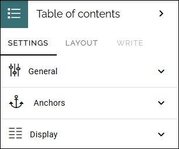
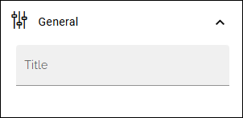
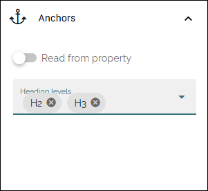
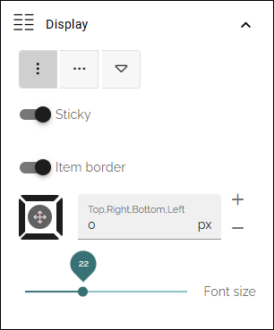

Table of contents block
========================

**We're working on a description of this block. Will be finished soon.**

Use this block to genereate a navigation from headings on the page or from a configured property.

Settings
********
The following settings are available:

General
--------
Just the usual possibility to add a title for the block.

Anchors
--------
These settings are available here:

You can either add the headings you would like to be used in the table of contents or select a property. 

When you select "Read from property" a list is shown where you select the property to use.

Display
--------
For Display, this is available:

+ **(Top icons)**: Click the icon for the type of display you want. The first two icons should be self explanatory. The right-most icon is for a dropdown navigation, especially useful for mobile navigation.
+ **Sticky**: Select this option if you would like the navigation to always be shown when scrolling. Besides that, the navigation indicates where you are on the page.
+ **Item border**: Active anchor in the navigation is always marked. When this option is selected, a thinnner border marks the anchors that are not active. Active anchor is still marked with a slightly broader line.
+ **(Padding)**: Add some padding if needed.
+ **Font size**: Use the slider to set the font size of the navigation.

Layout and Write
******************
The Write tab is not used here. The Layout tab contains general settings for blocks. For more information see: :doc:`General block settings </blocks/general-block-settings/index>`
