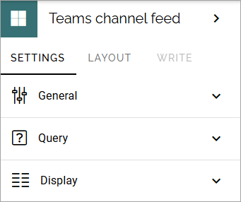
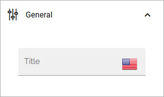
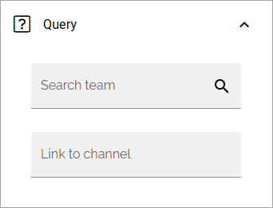
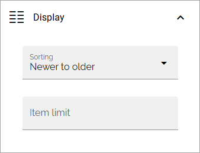

Teams channel feed
====================

As the name indicates, you can use the block to display a Teams channel feed. The feed will be read only.

**Note!** Teams channel feed is not available in Omnia on-prem.

The following settings are available:

General
************
Under General you can set a title for the block.

Query
*******
The Query settings will be these:

+ **Search team**: Select the team here.
+ **Channel list**: Shown when team has been selected. Choose channel for the team here.
+ **Link to channel**: Another option is to add the link to the channel in this field. (You then don't have to add the above.)

Display
**********
For Display, the following will be available:

+ **Sorting**: You can choose to list the newer items first, or the older items first.
+ **Item limit**: Set the number of items to be shown in the list before a "See more" link is shown.

