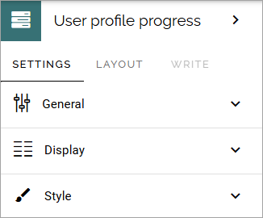
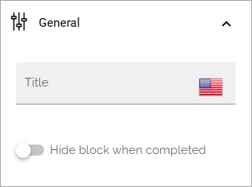
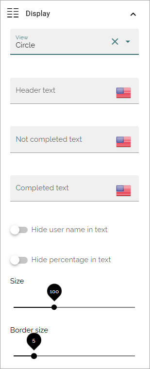
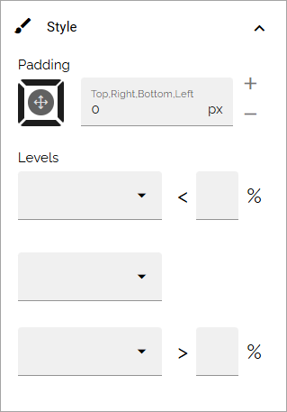

User profile progress
=====================================

This block is available in Omnia 7.7 and later. It's meant to be used with the new settings for user types. The block is displaying the user profile progress as a percantage.

The completeness impact for variuos user information blocks is set in the user type settings. It can be Low, Medium or High. For every information block that is completed, Low is 1 point, Medium is 2 and High 3. The aggregated points are then divided with the total points possible, to yield the percentage.

For more information about the user type settings, see the heading "User profile completion", on this page: :doc:`User types </admin-settings/tenant-settings/user-management/user-types/index>`

Also note that different templates can be created for different user types, meaning how the percentage is calculated can differ between user groups.

Settings
***********
The following settings are available for the block:

General
-----------
The following settings are found under General:

+ **Title**: You can adda title for the block if needed.
+ **Hide block when completed**: If the block shouldn't be shown at all if the user's progress is att 100%, select this option.

Display
-----------
The view can be either a line or a circle. Line has no further settings. For Circle, you can set the following:

+ **Header text**: You can add a text that is shown over the circle.
+ **Not completed text**: A default text for this message is always shown. If you would like the message when the profile is not completed to be something different. add the text here.
+ **Completed text**: A default text for this message is always shown. If you would like the message when the profile is completed to be something different. add the text here.
+ **Hide user name in text**: If the user's name should not be shown in the block, select this option.
+ **Hide the perecentage in text**: If the percentage should not be shown in the message, select this option. The precantage is still shown in the circle.
+ **Size**: Using the slider you can set the size of the circle.
+ **Border size**: Using the slider you can set the thickness of the line of the circle.

Style
-----
This is available for Style:

You can set some padding if needed. You can also set different colors to be shown for three different levels of progress. What the levels should be is up to you.

