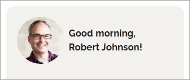
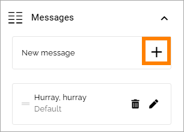
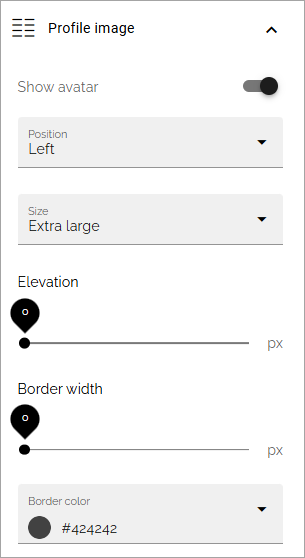
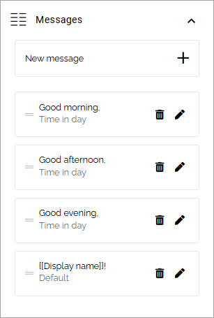
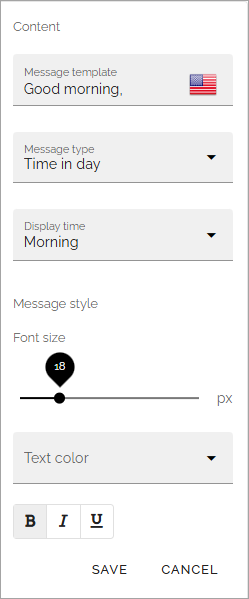

Welcome block
==================================

This block is available in Omnia 7.8 and later. It can be used for various messages, on specific dates or occasions, to the logged in user.

**Prerequisite**: You have to make sure that the properties you would like to use in this block is set up in Omnia admin. The Welcome block only supports Omnia user properties. Additional properties, like First name and Last name, can be made available through the configuration of MS Graph user details property mappings. See this page for more information: :doc:`SharePoint user profiles sync </admin-settings/tenant-settings/system/microsoft-365/sharepoint-user-profiles-sync>`

Here's a simple example of how the block can be used:

For information about how this example is set up, see the bottom of the page.

Settings
************
Available settings are these:

.. image:: welcome-block-settings.png
 
General
-------------
You can add a name for the block here, if needed.

.. image:: welcome-block-settings-general.png 

Profile image
---------------
Here you can choose to show an avatar (meaning a profile image), and if you do, the following settings are available:

.. image:: welcome-block-settings-profile.png 

You can see a preview in the block while testing different settings.

+ **Position**: Set the position for the avatar, in relation to the message(s); Left, Right, Top or Bottom.
+ **Size**: Set the size of the avatar; Small, Medium, Large or Extra large,
+ **Elevation and Border width**: Use the sliders to set avatar elevation and a border in pixels, if you want.
+ **Border color**: If you opt to use a border (meaning setting it to more than 0 pixels), you can set the color of the border here.

Messages
-----------
You can use this section to add one or more messages (including displaying the user's name if you want that). The following settings are available here:

.. image:: welcome-block-settings-messages.png 

+ **Message template**: Here you add the message. If you would like to display a name for the user, you add a new message and a token in this field, instead of a message. For available tokens, see below.
+ **Message type**: The message type can be Time in day, Date time, Day of week, Birthday or Default. Note that different settings are available for the message types. See below for more information. 
+ **Font size**: Use the slider to set the font size. Default font size is 14. You can't set the size smaller than that.
+ **Text color**: The text color for the message can be set here.
+ **Bold, italic or underscore**: The text can also be bold, italic or underscored.

You must save each message before adding another one.

When one message is added, click the plus to add another text:

You can use the pen and the dustbin for each message, to edit or delete it.

Available tokens for the name or other info
----------------------------------------------
In the Welcome block you can use the user properties set up in Omnia admin (Tenant > User management > User properties), as tokens to display the users name or other information. Two useful example are "Username" or "Display name". Here's how you add these two built in tokens in the "Message template" field (the ! is the difference):

+ {[Username]}
+ {[Display name]}!

For other user properties, you use the internal name. Here's an example of what the internal name could be:

+ Company name: ALMCompanyName
+ Department: ALMFLWOrganization
+ Job title: ALMUPJobTitle

This is just examples, you must check this in Omnia admin in your implementation.

Message types
----------------
You can use the message types this way:

+ Time in day: Select a day and time when the message should be shown. It's then shown, that time in day, until you delete it.
+ Date time: Set a period for when the message should shown; a start date and time and en end day and time.
+ Day of week: Set which day of the week the message should be shown. It's then shown, that day of the week, until you delete it.
+ Birthday: Select the data source for the birthday date. There must be a data source for birthday set up for this to work.
+ Default: The message is shown from now on, til you delete it.

Style
---------------
Just settings for padding available here.

.. image:: welcome-block-settings-style.png 

Welcome block implementation example
************************************
In this example (also shown at the top of the page):

These settings are used:

(No block title used and no padding added).

For "Profile image", the following settings are used:

As for "Messages", it's set up to show three different messages depending on time of day, and the user's name:

Note that the token "Display name" is used (last "message"). The message type "Time of day" is used for all three messages, and then Morning, Afternoon and Evening as "Display time". Here's the settings for Morning as an example:

