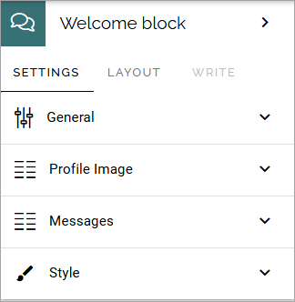
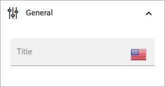
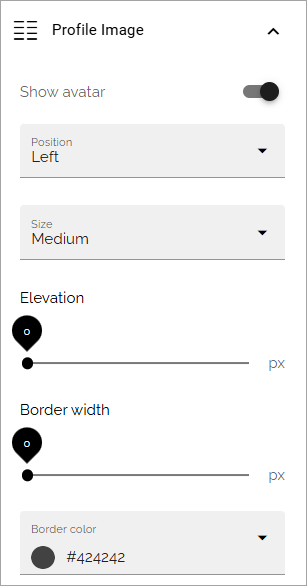
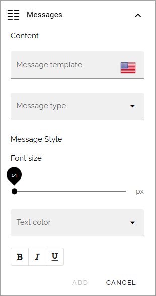
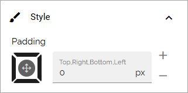

Welcome block
==================================

**(This page is just started).**

This block is available in Omnia 7.8 and later. It can be used for various messages to a user or a group, on specific dates or occasions.

Available settings are these:

 
General
************
You can add a name for the block here, if needed.

Profile image
***************
Here you can choose to show an avatar, and if you do, the following settings are available:

+ **Position**: 
+ **Size**: 
+ **Elavetion and Border width**: 
+ **Border color**: 

Messages
***************
The following settings are available here:

+ **Message template**: 
+ **Message type**: 
+ **Font size**: 
+ **Text color**: 
+ **Bold, italic or underscore**: 

Style
*********
Just settings for padding available here.

