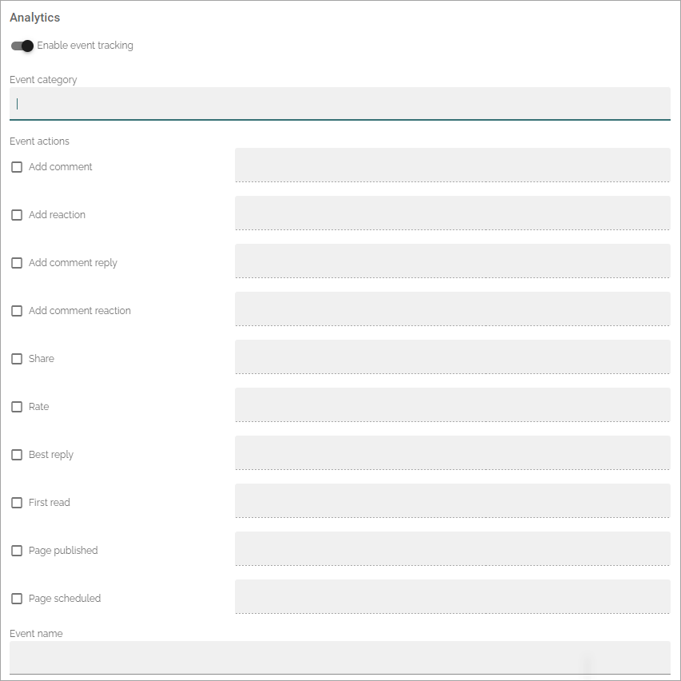
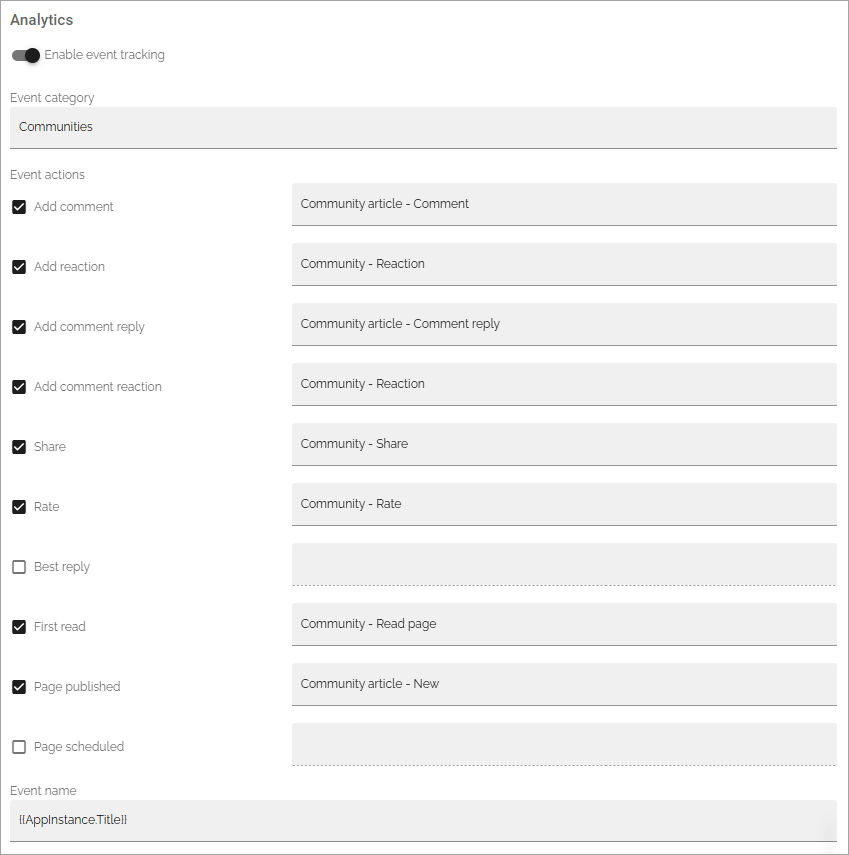

About Matomo event tracking
===================================

**This page is being edited.**

his information is intended for developers and administrators.

The option to analyze how an Omnia site (business profile) is used with Matomo has been available in Omnia for a while. In Omnia 7.8 options for Matomo event tracking has been added, making the possibilites for analytics almost endless.

Prequisites: The tenant feature "Analytics core setup" must be active and "Enable data collection" must be on for the business profiles you want to track.

As before, Matomo users and users that should have permissions to read analytics data, through any of the analytics blocks, must be added to the permissions settings for the business profile.

Settings for event tracking
*****************************
If analytics data is collected by Matomo, navigation is always tracked. Additionally, Matomo event tracking can be set up for pages (in page types), forms (in form types), documents in document rollups and action buttons.

When activated, a number of event trackings can be set up. Here's the available event actions for pages (per page type) as an example:

+ **Event category**: Add a category for the events. That category can then be selected in Matomo. This is a text field. If you type the same category for different page types, Matomo will handle them as the same category. But with that said, you can separate event data from, for example, different apps, using tokens in the event name field.
+ **Event actions**: Select the actions you want to track and then add a name for the action. If you type the same name in several of the (text) fields, Matomo will handle that event action name as one. Note that the names are valid within the category, not between different catagories.
+ **Event name**: In this field a token can be added. If it's empty, the same catagory name in different page types are always regarded as one category by Matomo. But if you like to use this category name in separate event data sets in Matomo, add a token here. An example: adding the token {{Appinstance.Title}} here means that separate event tracking data is created for different apps, but always using the event category you set here. See this page for available tokens for Matomo analytics: :doc:`Using tokens in Omnia </general-assets/using-tokens-in-omnia/index>`

**Important!** Be aware that if you change to a new category name in the field, Matomo will start collecting data to that new category from scractch. The analytics data collected for the former category name will still be available under the old name. The same is true if you change any event action name.

Here are two examples of event tracking for two different page types: Note that they both share the same category, meaning the analytics data collected here is the sum of the data collected for both page types.

As you can see, available event actions are the same for all page types, it's up to you to decide witch ones to use. Also note that "First read" is a bit special. Analytics data is only collected for this event action the first time a user opens a page.

.. image:: event-collected-example-2.png

Here you can note that the administrator has chosen to handle both "Add comment" and "Add comment reply" as one event action as they have the same name. Alos note that the token {{Appinstance.Title}} is added to the "Event name" field, meaning separate event tracking data is created for each app.

More information about Matomo analytics and event tracking
************************************************************
On these pages you can find more information about Matomo analytics and Matomo event tracking:

+ :doc:`Analytics (Matomo) settings </admin-settings/business-group-settings/settings/analytics/index>`
+ :doc:`Page type settings </pages/page-types/page-type-settings/index>`
+ :doc:`Types for forms </admin-settings/business-group-settings/forms/forms-settings/forms-types/index>`
+ :doc:`The document rollup block </blocks/document-rollup/index>`

