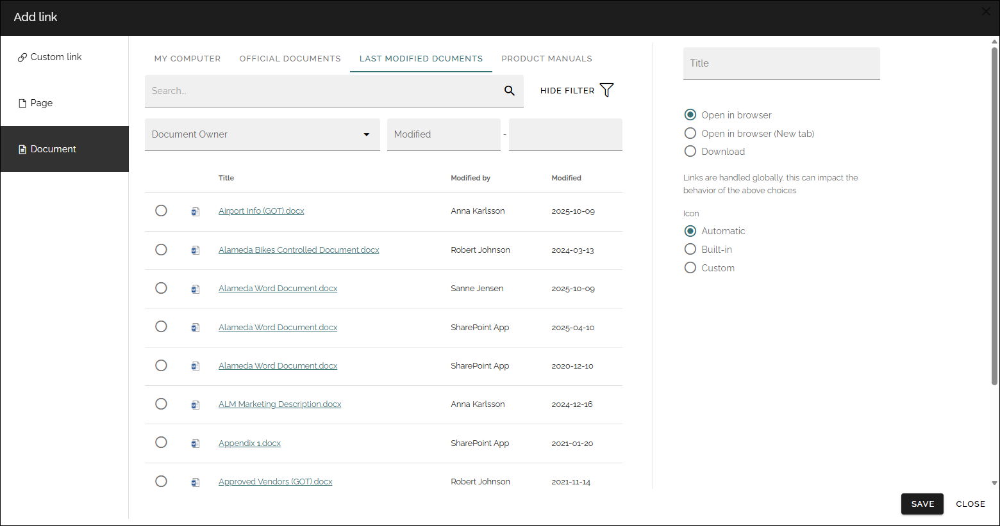
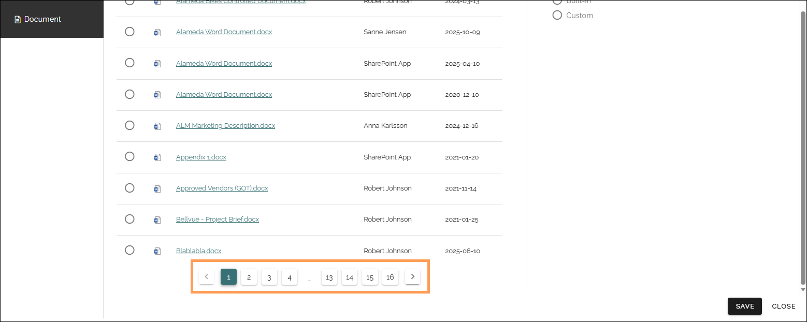

Add link
===========================================

Add link is used when a link is added in a block and a few other instances. 

.. image:: add-link-v75.png

You can use this asset to add a link to a page or document in the tenant, or create a custom link to any web page. A mailto link can be created using a custom link. Anchors are supported and can be used here, in a Custom link. 

Custom link
************
The following settings are available:

+ **URL**: Paste or type the URL (link) in this field. 
+ **Title**: Type a text to be shown for the clickable link.
+ **Anchor name**: To create a custom link to an anchor, type the anchor name in this field.
+ **Open in new window**: If the link should be opened in a new window, select this option. If not selected the link opens in the same window.
+ **Icon**: An Icon will be shown for each link. If you select "Automatic" the system will select the icon. Choosing "Built-in" you can select an icon from either "Font Awesome", "Microsoft" or "Flags", see below. If you select "Custom" you can use any image as an icon.

For information on how to use anchors, see: :doc:`Using anchors </general-assets/using-anchors/index>`

**Note!** When linking to an anchor you must always start by selecting the page the anchor is on.

Here are some examples of Font Awesome icons:

.. image:: font-awesome-new.png

Here are some examples of Microsoft icons:

.. image:: fabric-new.png

If you select "Flags" you can add a colored flag as an icon, for example:

.. image:: flags-new.png

Save after each link added.

Page
******
To add a link to a page, do the following:

1. Select Publishing app, if needed.

.. image:: add-link-page-1-v75.png

2. Select page collection. 

.. image:: add-link-page-v75.png

If the page collection isn't present in the list, select "Others..." so you can add the URL to any page collection.

.. image:: select-other-v75.png

3. As the next step, navigate to the page and select it. Here's an example:

.. image:: add-link-page-example-v75.png

4. Then use the options as above (Title, Open in new window and Icon).

5. Save after each page link added.

Note that you can also link to an anchor on a page, using a custom link. See above. Anchors can be created by authors in any parts of text on a page, can be set for block headings and are automatically created for sections, steps and accordion sections.

Document
*********
Picking documents here is very similar to using the document picker, but there are som differences. Similar is that the way you can search and browse for documents depends on settings in Omnia admin. Here's an example:

Use the document picker this way:

1. Select tab if more than one is shown.
2. Select a document.
3. Click "OK".

If the list is long, use the navigation at the bottom of the page to go between pages:

Depending on settings, a search can be available, and it can also be possible to filter the list on a property, in the example above on document owner. It's also possible to set a date interval for when the document was updated. 

The section to the right is not found in the document picker, they are available in other places, for example in the settings for a document rollup. 

+ **Title**: You can set a title (name) for the link using this field.
+ **Open in browser**: If the document should be opened in the browser, and not in an application on the user's computer, select this option.
+ **Open in brower (New tab)**: As above but also opened in a new tab.
+ **Download**: If it should be possible to download the document from the link, select this option. Note that other settings in the system may prevent download.
+ **Icon**: If you would like to add an icon to the link, use these settings.

Settings for the document picker
-----------------------------------
Settings for the document picker is found in the business Profile. As stated above, these settings is also used here. See: :doc:`Document picker settings </admin-settings/business-group-settings/settings/document-picker/index>`

