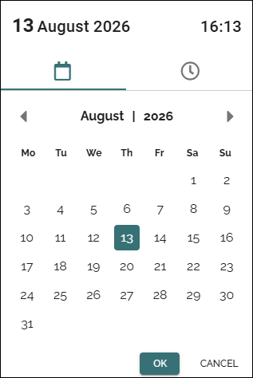
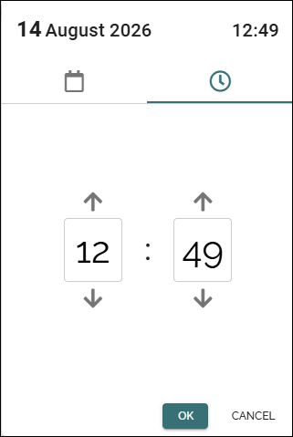
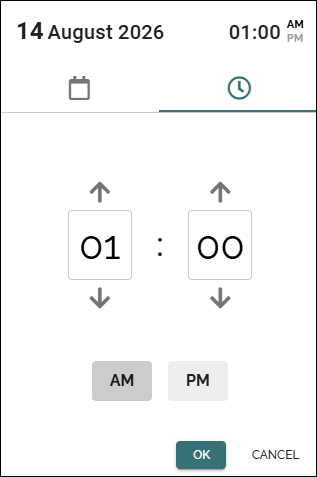

Date and time picker
=====================

This page describes the date and time picker in Omnia 7.12 and later.

When you select a date or time field, the date and time picker opens, with today's date and the actual time selected.

Here's an example:

You can use mouse navigation, use the keyboard, to navigate and select options.

Quick select
---------------
To select a date and time can be really quick:

1. Select the date.

The time picker is automatically opened.

2. Select the time and then OK to save the settings.

Select date
-----------------
In the date picker, you can change to another month using the arrows. Another way is to select the month and scoose another month in the calendar shown. Another year can be selected the same way.

Select time
---------------
Select the clock to open the time picker. If a 24 hour time format is set, it looks like this:

If a 12 hour format is set, you can select AM or PM:

Use the arrows to set time, or type the time in the fields.

When you're finished, just select OK to save you settings.

