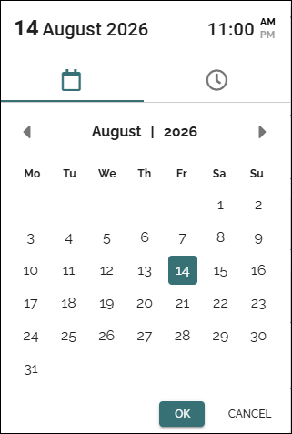

Date and time picker
=====================

This page describes the date and time picker in Omnia 7.12 and later.

When you click in a date or time field, the date and time picker opens, with today's date and the actual time selected.

The header then displays the date and time you have selected.

You can use mouse navigation, which is described here, but you can also use the keyboard, see below.

Here's an example:

.. image:: date-time-712.png

Quick select
---------------
To select a date and time can be really quick:

1. Click on the date.

The time picker is automatically opened.

2. Select the time and click OK to save the settings.

Select date
-----------------
In the date picker, you can change to another month using the arrows. Another way is to click on the month and select another month in the calendar shown. Another year can be selected the same way.

Select time
---------------
Click on the clock to open the time picker. If 24 hour system is set, it looks like this:

.. image:: date-time-time-712.png

If 12 hour system is set, you can select AM or PM:

Click on the arrows to set time.

When you're finished, just click OK to save you settings.

Keyboard support
-----------------------------------
You can use the keyboard to navigate to and select all options.

