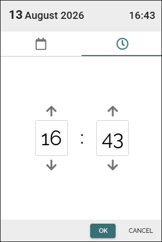

Date and time picker
=====================

**This page is a work in progress. Will be finished soon.**

This page describes the date and time picker in Omnia 7.12 and later.

The date and time picker provides an accessible and easy-to-use way to select both a date and a time. The header at the top of the picker displays the selected date and time, todays date and actual time when you enter the picker.

Here's an exampla:

.. image:: date-time-712.png

Select a date
-----------------
You can change to another month using the arrows. Select day by clicking on it. You can also select month or year by clicking on it.

Select a time
---------------
Switch to the time picker (the cklock) to set time.

You can change the hour and minute by:

Just click OK when to save you settings.

Keyboard and screen reader support
-----------------------------------
The date and time picker supports keyboard navigation and screen readers.

You can use the keyboard to:

+ Navigate to and select the day, month, and year in the header.
+ Navigate to the time in the header.
+ Navigate to and use the **Increase** and **Decrease** buttons.
+ Enter hour and minute values directly.
+ Navigate to and select **AM** or **PM** when using the 12-hour time format.

Screen readers can identify the selected date and time values and announce the available controls, including **Increase**, **Decrease**, **AM**, and **PM**.

