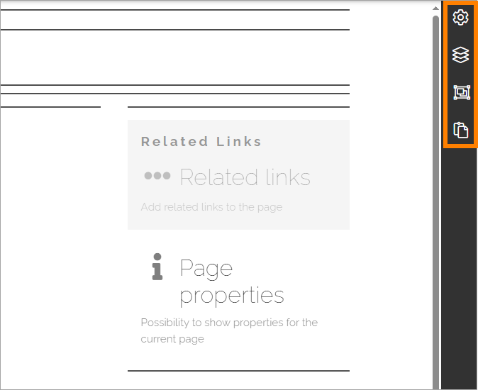

Layout explorer
====================

The Layout explorer can be used when creating or editing a page type or when editing pages. Regarding pages, it's available when editing a page in Design mode. 

This is the available options when working with page types:

The following options are found in Layout explorer. Select page for more information:

.. toctree::
   :titlesonly:

   page-layout/index
   layers/index
   layout-templates/index
   clipboard-sections-blocks/index

