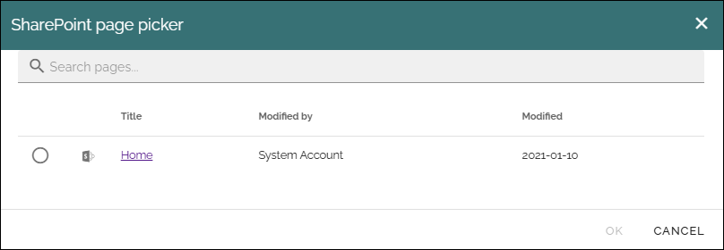

SharePoint page picker
=================================

In Omnia 7.12 and later, a specific SharePoint page picker is available. Here's a simple example:

You can search for SharePoint pages or browse by clicking one the libraries shown.

What is shown in the picker depend on Omnia admin settings, see: :doc:`SharePoint page picker settings </admin-settings/business-group-settings/settings/sharepoint-page-picker/index>`

